```{r setup, include=FALSE}
knitr::opts_chunk$set(echo = TRUE)
```

## Pregunta 1
Calcula las componentes, el módulo, la dirección y el sentido de los siguientes vectores (cada cuadradito representa una unidad de medida)

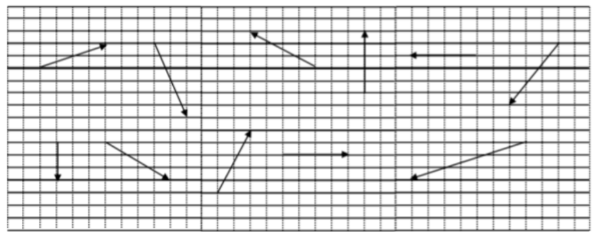


* Primer vector

$\vec{x_1} = (4,2) \qquad \Vert \vec{x_1} \Vert = \sqrt{4^2 + 2^2} =$ `r sqrt(4^2 + 2^2)` $\qquad \alpha = \arctan \left( \dfrac{2}{4} \right) =$ `r atan(2/4) * 180 / pi`

* Segundo vector

$\vec{x_2} = (0,-3) \qquad \Vert \vec{x_2} \Vert = \sqrt{0^2 + (-3)^2} =$ `r sqrt(0^2 + (-3)^2)` $\qquad \alpha = \arctan \left( \dfrac{-3}{0} \right) =$ `r atan(-3/0) * 180 / pi`

* Tercer vector

$\vec{x_3} = (2,-6) \qquad \Vert \vec{x_3} \Vert = \sqrt{2^2 + (-6)^2} =$ `r sqrt(2^2 + (-6)^2)` $\qquad \alpha = \arctan \left( \dfrac{-6}{2} \right) =$ `r atan(-6/2) * 180 / pi`

* Cuarto vector

$\vec{x_4} = (4,-3) \qquad \Vert \vec{x_4} \Vert = \sqrt{4^2 + (-3)^2} =$ `r sqrt(4^2 + (-3)^2)` $\qquad \alpha = \arctan \left( \dfrac{-3}{4} \right) =$ `r atan(-3/4) * 180 / pi`

* Quinto vector

$\vec{x_5} = (2,5) \qquad \Vert \vec{x_5} \Vert = \sqrt{2^2 + 5^2} =$ `r sqrt(2^2 + 5^2)` $\qquad \alpha = \arctan \left( \dfrac{5}{2} \right) =$ `r atan(5/2) * 180 / pi`

* Sexto vector

$\vec{x_6} = (-4,3) \qquad \Vert \vec{x_6} \Vert = \sqrt{(-4)^2 + 3^2} =$ `r sqrt((-4)^2 + 3^2)` $\qquad \alpha = \arctan \left( \dfrac{3}{-4} \right) =$ `r atan(3/-4) * 180 / pi`

* Séptimo vector

$\vec{x_7} = (4,0) \qquad \Vert \vec{x_7} \Vert = \sqrt{4^2 + 0^2} =$ `r sqrt(4^2 + 0^2)` $\qquad \alpha = \arctan \left( \dfrac{0}{4} \right) =$ `r atan(0/4) * 180 / pi`

* Octavo vector

$\vec{x_8} = (0,5) \qquad \Vert \vec{x_8} \Vert = \sqrt{0^2 + 5^2} =$ `r sqrt(0^2 + 5^2)` $\qquad \alpha = \arctan \left( \dfrac{5}{0} \right) =$ `r atan(5/0) * 180 / pi`

* Noveno vector

$\vec{x_9} = (-4,0) \qquad \Vert \vec{x_9} \Vert = \sqrt{(-4)^2 + 0^2} =$ `r sqrt((-4)^2 + 0^2)` $\qquad \alpha = \arctan \left( \dfrac{0}{-4} \right) =$ `r atan(0/-4) * 180 / pi`

* Decimo vector

$\vec{x_{10}} = (-3,-5) \qquad \Vert \vec{x_{10}} \Vert = \sqrt{(-3)^2 + (-5)^2} =$ `r sqrt((-3)^2 + (-5)^2)` $\qquad \alpha = \arctan \left( \dfrac{-5}{-3} \right) =$ `r atan(-5/-3) * 180 / pi`

* Decimo primer vector

$\vec{x_{11}} = (-7,-3) \qquad \Vert \vec{x_{11}} \Vert = \sqrt{(-7)^2 + (-3)^2} =$ `r sqrt((-7)^2 + (-3)^2)` $\qquad \alpha = \arctan \left( \dfrac{-3}{-7} \right) =$ `r atan(-3/-7) * 180 / pi`


## Pregunta 2

Calcula las componentes, el módulo, la dirección y el sentido de $\vec{AB}$ donde

* $A = (1,2)$, $B = (2,5)$
* $A = (-8,2)$, $B = (-5,-6)$
* $A = (2,-2)$, $B = (1,-5)$

### Primer punto

$\vec{AB} = (2-1, 5-2) = (1,3) \qquad \Vert \vec{AB} \Vert = \sqrt{1^2+3^2} =$ `r sqrt(1^2 + 3^2)` $\qquad \alpha = \arctan\left( \dfrac{3}{1} \right) =$ `r atan2(3,1) * 180 / pi`

### Segundo punto

$\vec{AB} = (-5-(-8), -6-2) = (3,-8) \qquad \Vert \vec{AB} \Vert = \sqrt{3^2+(-8)^2} =$ `r sqrt(3^2 + (-8)^2)` $\qquad \alpha = \arctan\left( \dfrac{-8}{3} \right) =$ `r atan2(-8,3) * 180 / pi`

### Tercer punto

$\vec{AB} = (1-2, -5-(-2)) = (-1,-3) \qquad \Vert \vec{AB} \Vert = \sqrt{(-1)^2+(-3)^2} =$ `r sqrt((-1)^2 + (-3)^2)` $\qquad \alpha = \arctan\left( \dfrac{-3}{-1} \right) =$ `r atan2(-3,-1) * 180 / pi`


## Pregunta 3
Dibuja con Geogebra y calcula las componentes del vector de

* Módulo 3, ángulo 30

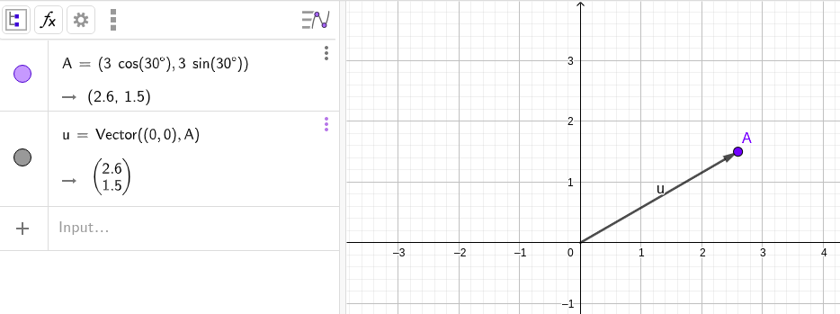

* Módulo 5, ángulo 120

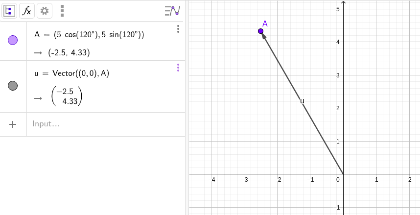

* Módulo 3, ángulo 180

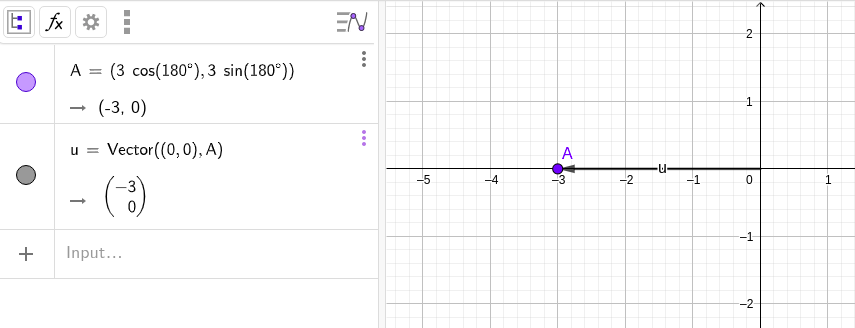

* Módulo 1, ángulo 240

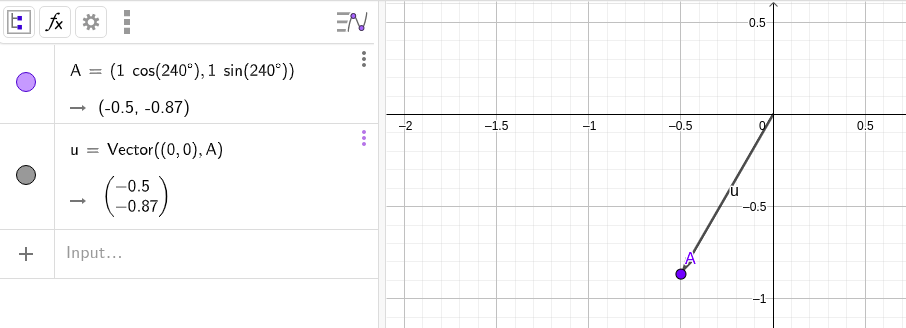


## Pregunta 4
Expresa una relación vectorial entre los vectores de la siguientes figuras

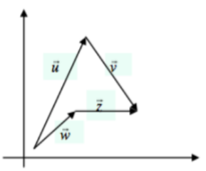


$$\vec{u} + \vec{v} = \vec{w} + \vec{z}$$


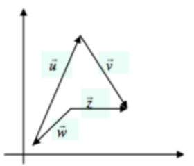

$$\vec{u} + \vec{v} = \vec{z}-\vec{w}$$


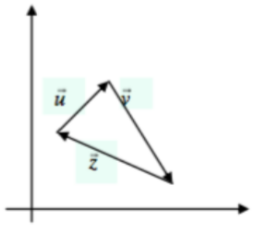

$$\vec{u} + \vec{v} = \vec{z} \quad \implies \quad \vec{v} + \vec{z} = \vec{u} \quad \implies \quad \vec{z} + \vec{u} = \vec{v}$$


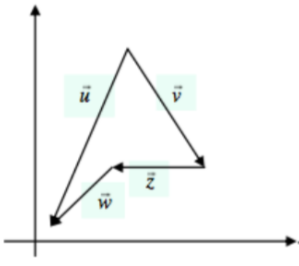

$$\vec{v} + \vec{z} + \vec{w} = \vec{u}$$


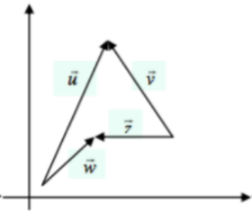

$$\vec{w} - \vec{z} + \vec{v} = \vec{u}$$


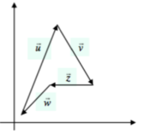

$$\vec{w} + \vec{u} + \vec{v} = \vec{z}$$


## Pregunta 5

Expresa relaciones vectoriales entre los vectores de las figuras

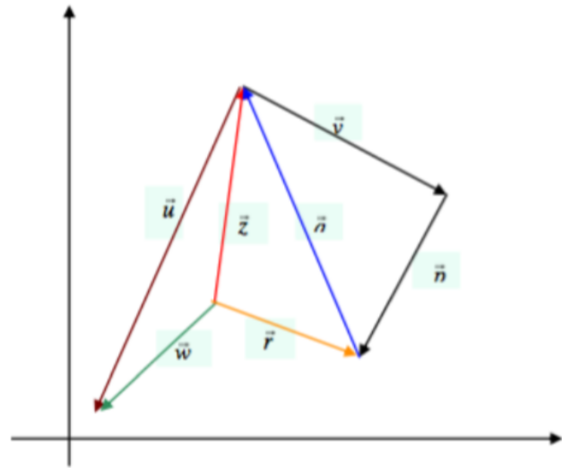

*Nota:* Como dos letras aparecen cortadas, se toma el vector de color azul como $\vec{q}$ y al otro vector negro como $\vec{p}$ 

$$\vec{v} + \vec{p} = -\vec{q} \qquad \vec{z} - \vec{r} = \vec{q} \qquad \vec{w} - \vec{z} = \vec{u}$$

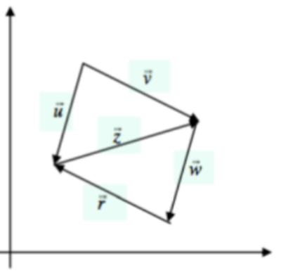

$$\vec{v} - \vec{u} = \vec{z} \qquad \vec{v} + \vec{w} + \vec{r} = \vec{u}$$


## Pregunta 6

Comprueba de dos formas diferentes si los puntos $A = (1,2,3)$, $B = (0,-1,2)$ y $C = (-2,7,0)$ están o no alineados. Razona ambos métodos y los pasos de cada procedimiento.

### Primer método
Para comprobar si todos los puntos  están alineados, se formarán dos vectores, uno cuyo origen y extremo sean los puntos $A$ y $B$, respectivamente; y otro cuyo origen y extremo sean los puntos $B$ y $C$, respectivamente.

$$\vec{AB} = (0-1,-1-2,2-3) = (-1,-3,-1) \qquad \vec{BC} = (-2-0,7-(-1),0-2) = (-2,8,-2)$$

Ahora obtendremos el ángulo que se forma entre los dos vectores

$$\alpha = \arccos \left( \frac{\langle \vec{AB}, \vec{BC} \rangle}{\Vert \vec{AB} \Vert \cdot \Vert \vec{BC} \Vert} \right) = \arccos \left( \frac{-20}{\sqrt{11} \cdot 6\sqrt{2}} \right) = 135^\circ 17'21''$$

Como el ángulo que forma no es igual a 180°, podemos afirmar que los puntos no están alineados.


### Segundo método

Considerando la propiedad de desigualdad triangular entre dos vectores, que nos dice que la longitud del vector resultante de la suma de dichos vectores es igual o menor a la suma de las longitudes de dichos vectores, se puede inferir que, en caso de ser igual, los puntos que los delimitan están alineados.

$$\Vert \vec{AB} + \vec{BC} \Vert = \Vert \vec{AC} \Vert \quad \implies \quad \Vert \vec{AC} \Vert = \sqrt{(-3)^2 + 5^2 + (-3)^2} = \sqrt{43} = 6.557438$$

$$\Vert \vec{AB} \Vert = \sqrt{(-1)^2 + (-3)^2 + (-1)^2} = \sqrt{11} \qquad \Vert \vec{BC} \Vert = \sqrt{(-2)^2 + 8^2 + (-2)^2} = 6 \sqrt{2}$$

$$\Vert \vec{AB} \Vert + \Vert \vec{BC} \Vert = 11.801906 \quad \implies \quad \Vert \vec{AC} \Vert < \Vert \vec{AB} \Vert + \Vert \vec{BC} \Vert$$

Cómo el vector $\vec{AC}$ es menor a la suma de las longitudes de los otros vectores, podemos concluir que los puntos de origen y extremo que forman a los tres vectores, no están alineados.


## Pregunta 7
Obtén las coordenadas del punto que divide en dos partes iguales el segmento de extremos $A = (2,0,-4)$, $B = (-4,4,2)$

$$\vec{AB} = (-4-2, 4-0, 2-(-4)) = (-6,4,6)$$

Para poder obtener los puntos, primero debemos determinar los componentes de un vector cuya longitud sea la mitad del vector $AB$.

Haciendo uso de las propiedades de la norma, se sabe que el producto de un escalar y la norma de un vector es igual a la norma del producto obtenido multiplicando el mismo vector por el mismo escalar. Si obtendremos la mitad de la longitud del vector:

$$\Vert \frac{1}{2} \vec{AB} \Vert = |\frac{1}{2}| \ \Vert \vec{AB} \Vert$$

De esta manera podemos concluir que multiplicar el vector por el escalar $\frac{1}{2}$ nos dará el vector cuyo extremo coincida con el punto a encontrar.

$$\frac{1}{2}\vec{AB} = (-3, 2, 3)$$

Ahora que conocemos sus componentes, y asumiendo el punto $A$ como punto de origen para el vector paralelo, obtendremos las coordenadas del punto extremo. Se encontrarán los valores de las incógnitas a partir de la resta hecha para obtener los componentes del vector, las cuales ya conocemos.

$$(a-2, b - 0, c-(-4)) = (-3, 2, 3)$$

Lo anterior da lugar a las siguientes ecuaciones

$$a-2 = -3 \quad \implies \quad a = -1$$
$$b-0 = 2 \quad \implies \quad b = 2$$

$$c-(-4) = 3 \quad \implies \quad c = -1$$

Gracias a esto obtenemos que el punto $P_1 = (-1,2,-1)$ es el que divide a la mitad el segmento formado por los punto $A$ y $B$


## Pregunta 8
Obtén las coordenadas del punto que divide en tres partes iguales el segmento de extremos $A = (2,0,-4)$, $B = (-4,4,2)$

Para poder obtener los puntos, primero debemos determinar los componentes de dos vectores cuya longitud sea una tercera y dos terceras partes del vector $AB$.

Haciendo uso de las propiedades de la norma, se sabe que el producto de un escalar y la norma de un vector es igual a la norma del producto obtenido multiplicando el mismo vector por el mismo escalar. Si obtendremos una tercera y dos terceras partes de la longitud del vector:

$$\Vert \frac{1}{3} \vec{AB} \Vert = |\frac{1}{3}| \ \Vert \vec{AB} \Vert \qquad \Vert \frac{2}{3} \vec{AB} \Vert = |\frac{2}{3}| \ \Vert \vec{AB} \Vert$$

De esta manera podemos concluir que multiplicar el vector por los escalares $\frac{1}{3}$ y $\frac{1}{3}$ nos darán los vectores cuyos extremos coincidan con los puntos a encontrar.

$$\frac{1}{3}\vec{AB} = \left (-2, \frac{4}{3}, 2 \right ) \qquad \frac{2}{3} \vec{AB} = \left( -4, \frac{8}{3},4 \right)$$

Ahora que conocemos sus componentes, y asumiendo el punto $A$ como punto de origen para ambos vectores, obtendremos las coordenadas del punto extremo. Se encontrarán los valores de las incógnitas a partir de la resta hecha para obtener los componentes del vector, las cuales ya conocemos.

Empezaremos por el primer vector.

$$(a-2, b - 0, c-(-4)) = \left (-2, \frac{4}{3}, 2 \right )$$

Lo anterior da lugar a las siguientes ecuaciones

$$a-2 = -2 \quad \implies \quad a = 0$$
$$b-0 = \frac{4}{3} \quad \implies \quad b = \frac{4}{3}$$
$$c-(-4) = 2 \quad \implies \quad c = -2$$

Los valores $a,b,c$ son las coordenadas del punto extremo del vector paralelo de $AB$, las cuales coinciden con el primer punto que divide al vector $AB$ en tres partes iguales

Ahora haremos lo mismo para el segundo vector

$$(a-2, b - 0, c-(-4)) = \left (-4, \frac{8}{3}, 4 \right )$$

Lo anterior da lugar a las siguientes ecuaciones

$$a-2 = -4 \quad \implies \quad a = -2$$
$$b-0 = \frac{8}{3} \quad \implies \quad b = \frac{8}{3}$$
$$c-(-4) = 4 \quad \implies \quad c = 0$$

Los puntos que dividen al segmento formado por los puntos $A$ y $B$ son:

$$P_1 = \left ( 0, \frac{4}{3}, -2 \right) \qquad P_2 = \left ( -2, \frac{8}{3}, 0 \right)$$


## Pregunta 9
Dados $\vec{u} = (1,2,3)$, $\vec{v} = (-2,-1,4)$, $\vec{w} = (0,2,0)$, $\vec{z} = (1,0,-3)$, calculad analítica y gráficamente el valor de

* $\vec{u} + \vec{v} - \vec{w} + \vec{z}$
* $(\vec{u} + \vec{v}) - (\vec{w} + \vec{z})$
* $3\vec{u} - 2\vec{v} + 4\vec{w} - \vec{z}$


### Primer punto

Método analítico
$$\vec{u} + \vec{v} - \vec{w} + \vec{z} = (1+(-2)-0+1, 2+(-1)-2+0, 3+4-0+(-3)) = (0,-1,4)$$

Método gráfico

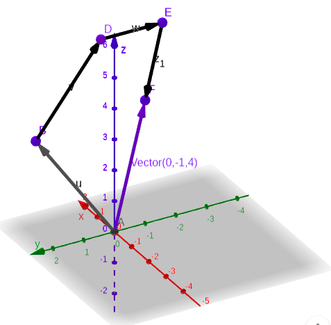


### Segunda punto

Método analítico
$$(\vec{u} + \vec{v}) - (\vec{w} + \vec{z}) = (1+(-2),2+(-1),3+4) - (0+1,2+0,0+(-3)) = (-1,1,7) - (1,2,-3)$$

$$(\vec{u} + \vec{v}) - (\vec{w} + \vec{z}) = (-1,1,7) - (1,2,-3) = (-2,-1,10)$$

Método gráfica

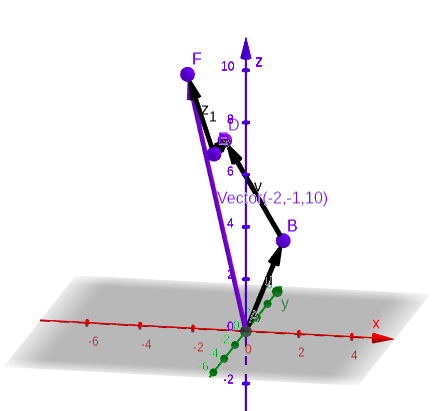


### Tercer punto

Método analítico

$$3\vec{u} = (3,6,9) \qquad -2\vec{v} = (4,2,-8) \qquad 4\vec{w} = (0,8,0) \qquad -\vec{z} = (-1,0,3)$$

$$3\vec{u} - 2\vec{v} + 4\vec{w} - \vec{z} = (3+4+0+(-1), 6+2+8+0, 9+(-8)+0+3) = (6,16,4)$$

Método gráfico

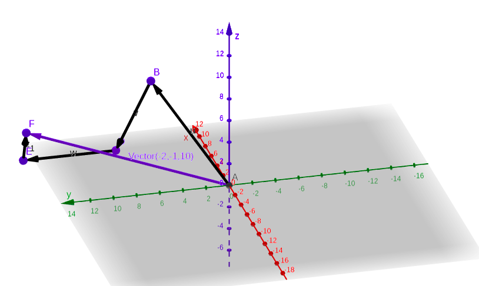


## Pregunta 10
Estudia si $u = (1,2,1)$ es combinación lineal de $v = (1,2,2)$, $w = (0,0,3)$, $z = (-2,4,3)$

$$(1,2,1) = a(1,2,2) + b(0,0,3) + c(-2,4,3)$$

$$\left \{ \begin{matrix} 
a & & & - & 2c & = & 1\\ 
2a & & & + & 4c & = & 2\\
2a & + & 3b & + & 3c & = & 1
\end{matrix} \right. \qquad A = \begin{pmatrix}
1 & 0 & -2\\ 2 & 0 & 4\\ 2 & 3 & 3
\end{pmatrix} \qquad b = \begin{pmatrix} 1\\ 2\\ 1 \end{pmatrix}$$

$$|A| = 1(0-12) - 0(6-8) + (-2)(6-0) = -24 \quad \implies \quad \text{rg}(A) = 3 \text{,   rg}(A|b) = 3$$

Cómo el rango de la matriz de coeficientes y de la ampliada es igual, y su valor es $n$, entonces se concluyé, en base al teorema de Rouché-Frobenius, que el sistema de ecuaciones lineales es compatible determinado.

Por ende, el vecor $u$ es combinación lineal de los vectores $v,w,z$


## Pregunta 11

Dado el conjunto de vectores $x = (1,2,1)$, $y = (-1,0,3)$, $z = (2,1,-4)$, $t \cdot u = (-3,-2,4)$, estudiad si el vector $u$ es combinación lineal de $x,y,z$. Estudiad también si $z$ es combinación lineal de $x,y$

¿$u$ es combinación lineal de $x,y,z$?

$$\left \{ \begin{matrix}
a & - & b & + & 2c & = & -3t\\
2a & & & + & c & = & -2t\\
a & + & 3b & - & 4c & = & 4t
\end{matrix} \right . \qquad A = \begin{pmatrix}
1 & -1 & 2\\ 2 & 0 & 1\\ 1 & 3 & -4
\end{pmatrix} \qquad \begin{pmatrix} -3t\\ -2t\\ 4t \end{pmatrix}$$

$$|A| = 1(0-3) + 1(-8-2) + 2(6-0) = -1 \quad \implies \quad \text{rg}(A) = 3 \text{,   rg}(A|b) = 3$$

Esto implica que el sistema de ecuaciones es compatible determinado, y por ende, $u$ sea combinación lineal de 
$x,y,z$

¿$z$ es combinación lineal de $x,y$?

$$\left \{ \begin{matrix}
a & - & b & = & 2\\
2a & & & = & 1\\
a & + & 3b & = & -4
\end{matrix} \right . \qquad A = \begin{pmatrix}
1 & -1\\ 2 & 0\\ 1 & 3
\end{pmatrix} \qquad \begin{pmatrix} 2\\ 1\\ -4 \end{pmatrix}$$

$$\begin{vmatrix} 1 & -1\\ 2 & 0 \end{vmatrix} = 1\cdot0 + 1\cdot2 = 2$$

Como el menor de rango 2 no es nulo, podemos inferir que el rango de $A$ es 2

$$|A|B| = 1(0 - 3) + 1(-8-1) + 2(6-0) = -3 - 9 + 12 = 0$$

Como la determinante de la ampliada es igual a 0, decimos que su rango es menor que 3. Sin embargo, el menor obtenido anteriormente también se puede manerjar con la matriz ampliada. Dicho lo anterior, concluimos que el rango de la matriz $A$ y su ampliada $A|B$ es igual a $n$, es decir, al número de incógnitas.

Por lo tanto, el sistema es compatible determinado y se confirma que $u$ es combinación lineal de los vectores $x,y$


## Pregunta 12
Dados los puntos $P = (3,0,0)$, $Q = (0,2,0)$, $R = (0,0,-4)$, $S = (3,-2,4)$

* Calcula la norma de los vectores $PQ$, $RS$, $OP$, $OR$
* Calcula la distancia entre $P$ y $Q$, $R$ y $S$, $O$ y $P$ y, $O$ y $R$
* Calcula los vectores unitarios proporcionales a $PQ$, $RS$, $OP$, $OR$
* Encuentra, si es posible, una combinación lineal de $OP$ y $OR$ tal que su resultado sea el vector $PQ$
* Encuentra, si es posible, una combinación lineal de $OP, OR, PS$ tal que su resultado sea el vector $PQ$

Vectores a usar

$$\vec{PQ} = (0-3,2-0,0-0) = (-3,2,0)$$
$$\vec{RS} = (3-0,-2-0,4+4) = (3,-2,8)$$
$$\vec{OP} = (3,0,0) \qquad \vec{OR} = (0,0,-4)$$
$$\vec{PS} = (3-3,-2-0,4-0) = (0,-2,4)$$


### Primer punto

$\Vert \vec{PQ} \Vert = \sqrt{(-3)^2 + 2^2 + 0^2} = \sqrt{9+4} = \sqrt{13} =$ `r sqrt(13)`

$\Vert \vec{RS} \Vert = \sqrt{3^2 + (-2)^2 + 8^2} = \sqrt{9+4+64} = \sqrt{77} =$ `r sqrt(77)`

$\Vert \vec{OP} \Vert = \sqrt{3^2 + 0^2 + 0^2} = \sqrt{9} = 3$

$\Vert \vec{OR} \Vert = \sqrt{0^2 + 0^2 + (-4)^2} = \sqrt{16} = 4$

### Segundo punto

$d(P,Q) = \Vert \vec{PQ} \Vert =$ `r sqrt(13)`

$d(R,S) = \Vert \vec{RS} \Vert =$ `r sqrt(77)`

$d(O,P) = \Vert \vec{OP} \Vert = 3$

$d(O,R) = \Vert \vec{OR} \Vert = 4$

### Tercer punto

* $PQ$

$\Vert \lambda\vec{PQ} \Vert = |\lambda| \ \Vert \vec{PQ} \Vert = 1 \quad \implies \quad \lambda = \dfrac{1}{\Vert \vec{PQ} \Vert} = \dfrac{1}{\sqrt{13}} =$ `r 1/sqrt(13)`

$\lambda \vec{PQ} = \dfrac{1}{\sqrt{13}}(-3,2,0)$

* $RS$

$|\lambda| \ \Vert \vec{RS} \Vert = 1 \quad \implies \quad \lambda = \dfrac{1}{\Vert \vec{RS} \Vert} = \dfrac{1}{\sqrt{77}} =$ `r 1/sqrt(13)`

$\lambda \vec{RS} = \dfrac{1}{\sqrt{77}}(3,-2,8)$

* $OP$

$|\lambda| \ \Vert \vec{OP} \Vert = 1 \quad \implies \quad \lambda = \dfrac{1}{\Vert \vec{OP} \Vert} = \dfrac{1}{3}$

$\lambda \vec{OP} = \dfrac{1}{3}(3,0,0)$

* $OR$

$|\lambda| \ \Vert \vec{OR} \Vert = 1 \quad \implies \quad \lambda = \dfrac{1}{\Vert \vec{OR} \Vert} = \dfrac{1}{4}$

$\lambda \vec{OR} = \dfrac{1}{4}(0,0,-4)$

### Cuarto punto

$$a \cdot \vec{OP} + b \cdot \vec{OR} = \vec{PQ} \implies a(3,0,0) + b(0,0,-4) = (-3,2,0)$$

$$\left \{ \begin{matrix} 
3a & & & = & -3\\
0 & +  & 0 & = & 2\\
 & - & 4b & = & 0 
\end{matrix} \right . \qquad A = \begin{pmatrix} 
3 & 0\\ 0 & 0\\ 0 & -4
\end{pmatrix} \qquad B = \begin{pmatrix} -3\\ 2\\ 0 \end{pmatrix}$$

A simple vista, podemos observar que en el sistema de ecuaciones lineales existe una incongruencia al decir que $0 + 0 = 2$. Por ende, podemos concluir que el sistema no tiene solución y $PQ$ no es combinación lineal de $OP$ y $OR$

### Quinto punto

$$a \cdot \vec{OP} + b \cdot \vec{OR} = \vec{PQ} + c \cdot \vec{PS} \implies a(3,0,0) + b(0,0,-4) + c \cdot (0,-2,4) = (-3,2,0)$$

$$\left \{ \begin{matrix} 
3a & & & & & = & -3\\
 & & & - & 2c & = & 2\\
 & - & 4b & + & 4c & = & 0 
\end{matrix} \right . \qquad A = \begin{pmatrix}
3 & 0 & 0\\ 0 & 0 &-2\\ 0 & -4 & 4
\end{pmatrix} \qquad B = \begin{pmatrix} -3\\ 2\\ 0 \end{pmatrix}$$

La determinante de la matriz de coeficientes $A$ es 

$$|A| = 3(0-8) = -24$$

Gracias a ellos, inferimos que el rango tanto de la matriz $A$ y la ampliada $A|B$ es igual a 3, lo que nos da cabida a decir que el sistema propuesto es compatible determinado.

Por lo anterior, podemos decir que el vector $PQ$ es combinación lineal de $OP,OR,PS$


## Pre7gunta 13
Encuentra los valores de $a$ y $b$ para que $(a,b,-37,-3)$ sea combinación lineal de (1,2,-5,3) y (2,-1,4,)

$$x(1,2,-5,3) + y(2,-1,4,7) = (a,b,-37,-3)$$

$$\left \{ \begin{matrix}
x & + & 2y & = & a\\
2x & - & y & = & b\\
-5x & + & 4y & = & -37\\
3x & + & 7y & = & -3
\end{matrix} \right . \qquad A = \begin{pmatrix}
1 & 2\\ 2 & -1\\ -5 & 4\\ 3 & 7
\end{pmatrix} \qquad b = \begin{pmatrix} a\\ b\\ -37\\ -3 \end{pmatrix}$$

Empezaremos por resolver parcialmente este problema. Obtendremos los valores de $x$ y $y$ para el sistema formado por las dos últimas ecuaciones

$$A = \begin{pmatrix} -5 & 4\\ 3 & 7 \end{pmatrix} \qquad b = \begin{pmatrix} -37\\-3  \end{pmatrix} \qquad |A| = -47$$\

$x = \dfrac{\begin{vmatrix} -37 & 4\\ -3 & 7 \end{vmatrix}}{|A|} = \dfrac{-247}{-47} =$ `r x = 247/47;x`

$y = \dfrac{\begin{vmatrix} -5 & -37\\ 3 & -3 \end{vmatrix}}{|A|} = \dfrac{126}{-47} =$ `r y = 126/(-47); y`

Una vez obtenidos los valores de $x$ y $y$, los remplazaremos en las dos primeras ecuaciones para conocer el valor de $a$ y $b$ 

$a = \dfrac{247}{47} + 2 \left (-\dfrac{126}{47} \right ) =$ `r x + 2*y`

$b = 2 \left ( \dfrac{247}{47} \right ) - \left (-\dfrac{126}{47} \right ) =$ `r 2*x - y`


## Pregunta 14
Escribe razonadamente dos vectores del espacio $\mathbb{R}^3$ que sean perpendiculares. Obtén también un tercer vector perpendicular a los otros 2.

Como al final se obtendrán 3 vectores perpendiculares entre sí, 2 de ellos serán coplanares y un tercero será perpendicular a dicho plano.

$$\vec{u} = (5,-3,0) \qquad \vec{v} = (6,10,0)$$
$$\langle \vec{u}, \vec{v} \rangle = 5\cdot6 + (-3)\cdot10 + 0 \cdot 0 = 0$$
Los vectores $\vec{u}$ y $\vec{v}$ son perpendiculares, debido a que su producto escalar es 0

$$\vec{w} = (0,0,7)$$

$$\langle \vec{u}, \vec{w} \rangle = 5\cdot0 + (-3)\cdot0 + 0 \cdot 7 = 0 \qquad \langle \vec{v}, \vec{w} \rangle = 6\cdot0 + 10\cdot0 + 0 \cdot 7 = 0$$

El vector $\vec{u}$ y $\vec{v}$ son perpendiculares del vector $\vec{w}$


## Pregunta 15
Dados los vectores $u = (1,2,3)$, $v = (-2,-1,4)$, $w = (0,2,0)$, $z = (1,0,-3)$, calculad

* $\langle u,v \rangle$

$$\langle u,v \rangle = 1\cdot(-2) + 2\cdot(-1) + 3\cdot4 = 8$$

* $\langle u,-v \rangle$

$$\langle u,-v \rangle = 1\cdot2 + 2\cdot1 + 3\cdot(-4) = -8$$

* $\langle u + v, w + z \rangle$

$$\langle u + v, w + z \rangle = -1\cdot1 + 1\cdot2 + 1\cdot(-3) = -2$$

* $\langle u - w, v - z \rangle$

$$\langle u - w, v - z \rangle = 1\cdot(-3) + 0\cdot(-1) + (-3)\cdot7 = -24$$

* $\Vert u \Vert$

$$\Vert u \Vert = \sqrt{1^2 + 2^2 + (-3)^2} = \sqrt{1+4+9} = \sqrt{14}$$

* $\Vert z \Vert$

$$\Vert z \Vert = \sqrt{1^2 + 0^2 + (-3)^2} = \sqrt{1+9} = \sqrt{10}$$

* $\Vert u + v - w + z \Vert$

$$u + v - w + z = (0,-1,-2)$$

$$\Vert u + v - w + z \Vert = \sqrt{0^2 + (-1)^2 + (-2)^2} = \sqrt{1+4} = \sqrt{5}$$

## Pregunta 16
Calcula la distancia entre los puntos $A = (2,-3)$, $B = (-2,5)$

$$\vec{AB} = (-4,8)$$

$$d(A,B) = \Vert \vec{AB} \Vert = \sqrt{(-4)^2 + 8^2} = \sqrt{16+64} = \sqrt{80}$$


## Pregunta 17
Dí cuáles de las siguientes parejas de vectores son ortogonales. Determina en cada caso el ángulo que forman los vectores

* $(1,2),(-2,1)$

$$\vec{u} = (1,2) \quad \vec{v} = (-2,1)$$
$$\alpha = \arccos \left ( \frac{\langle \vec{u},\vec{v} \rangle}{\Vert \vec{u} \Vert \cdot \Vert \vec{v} \Vert} \right ) = \arccos \left ( \frac{1\cdot(-2) + 2\cdot1}{\sqrt{5} \cdot \sqrt{5}} \right ) = \arccos \left ( \frac{0}{5} \right ) = \arccos(0) = 90^\circ$$

* $(1,-1,1),(-1,1,-1)$

$$\vec{u} = (1,-1,1) \quad \vec{v} = (-1,1,-1)$$

$$\alpha = \arccos \left ( \frac{\langle \vec{u},\vec{v} \rangle}{\Vert \vec{u} \Vert \cdot \Vert \vec{v} \Vert} \right ) = \arccos \left ( \frac{1\cdot(-1) + (-1)\cdot1 + 1\cdot(-1)}{\sqrt{3} \cdot \sqrt{3}} \right ) = \arccos \left ( \frac{-3}{3} \right ) = \arccos(-1) = 180^\circ$$


* $(a,-b,1), (b,a,0) \text{ con } a,b \in \mathbb{R}$

$$\vec{u} = (a,-b,1) \quad \vec{v} = (b,a,0)$$

$$\alpha = \arccos \left ( \frac{\langle \vec{u},\vec{v} \rangle}{\Vert \vec{u} \Vert \cdot \Vert \vec{v} \Vert} \right ) = \arccos \left ( \frac{a\cdot b + (-b)\cdot a + 1\cdot 0}{\Vert \vec{u} \Vert \cdot \Vert \vec{v} \Vert} \right ) = \arccos \left ( \frac{0}{\Vert \vec{u} \Vert \cdot \Vert \vec{v} \Vert} \right ) = \arccos(0) = 90^\circ$$


Con base en las operaciones realizadas para obtener el ángulo entre cada par de vectores, se concluyó que el primer y el último par, $(1,2),(-2,1)$ y $(a,-b,1),(b,a,0)$ respectivamente, son vectores ortogonales.


## Pregunta 18
Sea $u = (1,2,-3)$

* Encuentra un vector unitario de la misma dirección y sentido que $u$

Para ello buscaremos un vector proporcional cuya norma sea igual a 1 

$|\lambda| \ \Vert \vec{u} \Vert = 1 \quad \implies \quad \lambda = \dfrac{1}{\Vert \vec{u} \Vert} = \dfrac{1}{\sqrt{14}} =$ `r lamb = 1/sqrt(14);lamb`

$\lambda \vec{u} =$ `r sprintf("(%f, %f, %f)", lamb*1, lamb*2, lamb*(-3))`

* Encuentra un vector de la misma dirección y sentido que $u$ y de módulo 3

Usaremos el mismo vector anterior, pero multiplicado por el escalar 3, dándonos así el resultado querido

$\lambda \vec{u} =$ `r sprintf("(%f, %f, %f)", 3*lamb*1, 3*lamb*2, 3*lamb*(-3))`

* Encuentra un vector unitario perpendicular a $u$

Mientras todos los elementos sean iguales, un vector será perpendicular a $u$

$$\vec{v} = (a,a,a)$$

$$\langle \vec{u}, \vec{v} \rangle = 0 \quad \implies \quad 1\cdot a + 2\cdot a + (-3)\cdot a = 3a-3a = 0$$

$$\Vert \vec{v} \Vert = 1 \quad \implies \quad \sqrt{a^2+a^2+a^2} = 1 \quad \implies \quad \sqrt{3a^2} = 1$$

$$3a^2 = 1 \quad \implies \quad a^2 = \frac{1}{3} \quad \implies \quad a = \sqrt{\frac{1}{3}}$$

De esta manera, el vector unitario que es perpendicular a $u$ es

$$\vec{v} = \left ( \sqrt{\frac{1}{3}}, \sqrt{\frac{1}{3}}, \sqrt{\frac{1}{3}} \right )$$


## Pregunta 19
Dados los vectores $u = (2,0,0)$, $\vec{v} = (0,1,-3)$ y $w = au + bv$, ¿qué condición deben cumplir los escalares $a,b \in \mathbb{R}$ para que $\ \dots$

* $\dots \ w$ sea ortogonal al vector $(1,1,1)$?

$$\vec{w} = (2a,b,-3b) \quad \vec{z} = (1,1,1)$$

Para que ambos vectores sean ortogonales, el producto escalar de ambos debe ser igual a 0

$$\langle \vec{w}, \vec{z} \rangle = 0 \quad \implies \quad 2a-2b = 0 \quad \implies \quad a = b$$

A partir de la expresión anterior, se concluye que para que el vector $w$ sea ortogonal con el vector $(1,1,1)$, las variables $a$ y $b$ tienen que ser iguales.

* $\dots \ w$ sea unitario?

Para que el vector $w$ sea unitario, su norma debe ser igual a 1

$$\Vert \vec{w} \Vert = 1 \quad \implies \quad \sqrt{(2a)^2 + b^2 + (-3b)^2} = \sqrt{4a^2 + b^2 +9b^2} = 1$$

$$\sqrt{4a^2 + 10b^2} = 1 \quad \implies \quad 4a^2 + 10b^2 = 1 \quad \implies \quad a = \sqrt{\frac{1}{4}-\frac{5}{2}b^2}$$

A pesar de llegar a expresar cuánto equivale $a$, dicha expresión tiene solución solamente cuando $b = 0$, lo que nos lleva a lo siguiente

$$a = \sqrt{\frac{1}{4}} = \frac{1}{2}$$

* $\dots \ w$ sea paralelo al vector $(1,-2,6)$

$$\vec{w} = (2a,b,-3b) \quad \vec{z} = (1,-2,6)$$

Para que dos vectores sean paralelos deben ser proporcionales. El escalar por el que se multiplica al vector $z$ pertenece al conjunto de números reales $\lambda \in \mathbb{R}$. 

Partiendo de la idea que multiplicar el vector $w$ por el inverso multiplicativo de $\lambda$ da como resultado $z$, entonces se podrá definir una expresión para determinar el valor tanto de $a$ como de $b$, según el valor de proporción definido

$$\lambda \vec{z} = \vec{w} \quad \implies \quad \vec{z} = \frac{1}{\lambda} \vec{w}$$

$$\frac{2a}{\lambda} = 1 \quad \implies \quad a = \frac{\lambda}{2}$$

$$\frac{b}{\lambda} = -2 \quad \implies \quad b = -2\lambda$$

* Para $a = 1, \ b = -1$, calculad el vector de módulo 3, con sentido opuesto a $w$

El vector $w$ según los valores ya establecidos, es

$$\vec{w} = (2(1),(-1),-3(-1)) = (2,-1,3)$$

Se plantea buscar un vector de módulo 3, que sea tenga sentido opuesto a $w$, para ello, se debe multiplicar por un escalar negativo que de como resultado un vector paralelo a $w$ de módulo 3

$\lambda \Vert \vec{w} \Vert  = 3 \quad \implies \quad \lambda = \dfrac{3}{\sqrt{14}} =$ `r x = 3/sqrt(14);x`

$-\lambda \vec{w} =$ `r sprintf("(%f, %f, %f)", x*2, x*(-1), x*3)`


## Pregunta 20
Sean $x, y$ dos vectores tales que $\Vert x \Vert = 3$ e $\Vert y \Vert = 2$. ¿Puede ocurrir que $\langle x,y \rangle = -7$? ¿Qué valores puede tomar el producto escalar $\langle x,y \rangle$? ¿Cuál es el máximo valor que puede tomar $\Vert x - y \Vert$? ¿Y el mínimo? ¿Cuánto vale $\Vert x - y \Vert$ si los dos vectores son perpendiculares?


* ¿Puede ocurrir que $\langle x,y \rangle = -7$?

Si. Para ello partiremos del teorema que nos dice que $\langle u,v \rangle = \Vert u \Vert \cdot \Vert v \Vert \cdot \cos(\alpha)$, igualándolo a $-7$

$$\langle x,y \rangle = \Vert x \Vert \cdot \Vert y \Vert \cdot \cos(\alpha) = -7$$

Sabemos el valor de la norma de $x,y$, pero desconocemos el valor que su ángulo puede tomar. Para verificar que es posible que ocurra $\langle x,y \rangle = -7$

$\Vert x \Vert \cdot \Vert y \Vert \cdot \cos(\alpha) = -7 \quad \implies \quad \alpha = \arccos \left( \frac{-7}{\Vert x \Vert \cdot \Vert y \Vert} \right) = \arccos \left( \frac{-7}{6} \right)$

La función arcoseno admite como dominio al intervalo $[-1,1]$. Siendo $-7/6 < -1$, entonces no es posible calcular el ángulo de este vector, y por ende, no existe manera que $\langle x,y \rangle = -7$

* ¿Qué valores puede tomar el producto escalar $\langle x,y \rangle$?

El teorema mencionado anteriormente será de gran utilidad. Este aclara

$$\langle x,y \rangle = \Vert x \Vert \cdot \Vert y \Vert \cdot \cos(\alpha)$$
$$\langle x,y \rangle =  6 \cos(\alpha)$$

Como se plantea en el enunciado, tanto la norma de $x$ e $y$ están ya definidas. Sin embargo no es lo mismo para el ángulo entre los vectores.

Como se estudia cuáles son los valores que acepta el producto escalar, entonces se razona lo siguiente. La función coseno solo puede regresar los números del intervalo $[-1,1]$. Sabiendo el límite inferior y superior del intervalo, podemos definir los siguientes casos

$$\langle x,y \rangle = 6(-1) = -6 \qquad \langle x,y \rangle = 6(1) = 6$$

De esta manera obtenemos dos nuevos límites para el producto escalar de $x$ e $y$

Por lo tanto podemos concluir que

$$-6 \leq \langle x,y \rangle \leq 6$$

* ¿Cuál es el máximo valor que puede tomar $\Vert x - y \Vert$? ¿Y el mínimo?

Dada la expresión $\Vert x - y \Vert$?, esta puede representarse de la siguiente manera

$$\Vert x - y \Vert = \sqrt{\langle x-y,x-y \rangle} = \sqrt{\Vert x \Vert^2 + \Vert y \Vert^2 - 2\langle x,y \rangle}$$

Se sabe tanto la norma de $x$ e $y$, así como el límite inferior y superior del intervalo que define la solución para $\langle x,y \rangle$. Conociendo todos estos datos, se obtendrá el mínimo y el máximo valor

$$\Vert x - y \Vert = \sqrt{3^2 + 2^2 - 2(-6)} = \sqrt{9+4+12} = \sqrt{25} = 5$$

$$\Vert x - y \Vert = \sqrt{3^2 + 2^2 - 2(6)} = \sqrt{9+4-12} = \sqrt{1} = 1$$

El valor máximo de $\Vert x - y \Vert$ es 5, y su valor mínimo es 1


## Pregunta 21
Demuestra que $\Vert x + y \Vert \leq \Vert x \Vert + \Vert y \Vert$

$$\Vert x + y \Vert^2 = \langle x+y, x+y \rangle = \Vert x \Vert^2 + 2\langle x,y \rangle + \Vert y \Vert^2$$

Todo número real es menor o igual a su valor absoluto, $x \leq |x|$. Si obtenemos el valor absoluto del producto escalar $\langle x,y \rangle$, el resultado obtenido sería mayor o igual al producto. Esto afectaría la expresióń anterior de la siguiente manera

$$\Vert x + y \Vert^2 \leq \Vert x \Vert^2 + 2|\langle x,y \rangle| + \Vert y \Vert^2$$

Lo interesante de esta expresión es su relación con la desigualdad de Couchy-Schwarz, puesto que el valor absoluto del producto escalar entre $x,y$ es menor o igual al producto de sus normas, $|\langle x,y \rangle| = \Vert u \Vert \cdot \Vert v \Vert$. 

$$\Vert x + y \Vert^2 \leq \Vert x \Vert^2 + 2|\langle x,y \rangle| + \Vert y \Vert^2 \leq \Vert x \Vert^2 + 2 \cdot \Vert x \Vert \cdot \Vert y \Vert + \Vert y \Vert^2$$

Esto se puede reducir a lo siguiente

$$\Vert x + y \Vert^2 \leq \Vert x \Vert^2 + 2\Vert x \Vert \cdot \Vert y \Vert + \Vert y \Vert^2$$

La segunda expresión puede rescribirse como $(\Vert x \Vert + \Vert y \Vert)^2$ puesto que es un trinomio cuadrado perfecto. Así nos quedá la expresión

$$\Vert x + y \Vert^2 \leq (\Vert x \Vert + \Vert y \Vert)^2 \quad \implies \quad \Vert x + y \Vert \leq \Vert x \Vert + \Vert y \Vert$$

demostrando que $\Vert x + y \Vert \leq \Vert x \Vert + \Vert y \Vert$


## Pregunta 22

Sean $P = (5,7)$ y $Q = (8,3)$ los vértices del cuadrado $PQRS$

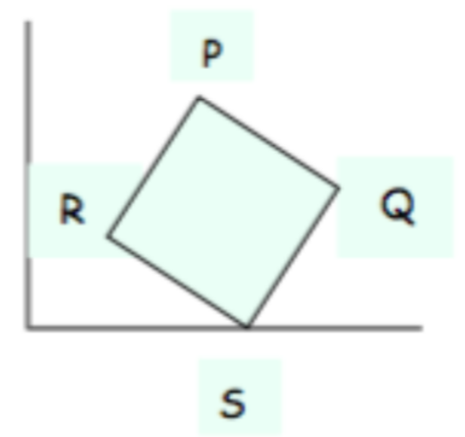

* Calcula el punto $S$ sabiendo que se encuentra sobre el eje $OX$

Definimos dos vectores

$$\vec{PQ} = (3,-4) \qquad \vec{QS} = (a-8, -3)$$

La variable $a$ indica la coordenada $x$ del punto $S$, por lo que se necesita obtener su valor. Su coordenada $y$, se infiere que es igual a 0

La norma es igual para todos los vectores que se forman, y que asemejan un lado de un cuadrado

$$\Vert \vec{PQ} \Vert = \sqrt{3^2 + (-4)^2} = 5$$

Esto aplicado al vector $QS$ sería

$$\Vert \vec{QS} \Vert = \sqrt{(a-8)^2 + (-3)^2} = 5$$

$$\sqrt{(a-8)^2 + (-3)^2} = 5 \quad \implies \quad (a-8)^2 + 9 = 25 \quad \implies \quad (a-8)^2 = 16$$

$$a-8 = \pm 4 \quad \implies \quad a = \pm4 + 8$$

Existen dos resultados distintos para $a$, sin embargo, debido a que la coordenada $x$ se encuentra entre los valores 5 y 8, por ello 4 será negativo. Esto da como resultado, $a = 4$

Por lo tanto

$$S = (4,0)$$


* Calcula el punto $R$

Primero definimos dos vectores con los que trabajaremos

Analizando el cuadrado dibujado, es posible realizar el cálculo del punto $R$ mediante una simple operación,

A partir de los vectores $\vec{OS}, \vec{SR}$, donde el segundo vector es equivalente al vector $PQ = (3,-4)$, se restará el primero menos el segundo para obtener el vector $\vec{OR}$, cuyos componentes es igual a las coordenadas de $R$

$$R = \vec{OS} - \vec{SR} = (4,0) - (3,-4) = (1,4)$$

De esta manera, el punto $R$ tiene coordenadas $(1,4)$


* Calcula el centro y el área del cuadrado

Para calcular su centro, se realizará una suma entre los vectores $OS$ y el vector proporcional a $SP$

$\vec{SP} = (5-4,7-0) = (1,7)$

$$\vec{OC} = \vec{OS} + \frac{1}{2}\vec{SP} = (4,0) + \left( \frac{1}{2}, \frac{7}{2} \right) = \left( \frac{9}{2}, \frac{7}{2} \right)$$

Las coordenadas de su centro son $\left( \dfrac{9}{2}, \dfrac{7}{2} \right)$

En el caso de su área, solo usaremos la fórmula general para sacar el área de cualquier cuadrado en base a la longitud de sus lados, que es igual a la norma de los vectores que forman el cuadrado

$$A_c = \Vert \vec{PQ} \Vert^2 = 5^2 = 25$$


## Pregunta 23
Comprueba que la operación entre dos vectores de $\mathbb{R}^3$ definida por

$$\langle /(a,b,c), (x,y,z) \rangle = ax + 2by + 3cz$$

cumple las condiciones de producto escalar. Calcula la norma del vector $u = (-1.0.2)$ con esta definición y utilizando también la del producto escalar usual

Primero usaremos la primera definicíón

$$\Vert \vec{u} \Vert = \sqrt{\langle \vec{u}, \vec{u} \rangle} = \sqrt{(-1)(-1) + 2(0)(0) + 3(2)(2)} = \sqrt{1+0+12} = \sqrt{13}$$

$$\Vert \vec{u} \Vert = \sqrt{(-1)^2 + 0^2 + 2^2} = \sqrt{5}$$

No se cumple la definición antes mencionada


## Pregunta 24
Calcula el ángulo que forman $x$ e $y$ sabiendo que $\Vert x \Vert = 3$, $\Vert y \Vert = 5$ y $\Vert x + y \Vert = 7$

Debido a que la suma de $x + y$, junto con los otros vectores forman un triángulo, usaremos el teorema de cosenos para poder obtener el valor del ángulo

$$\Vert x + y \Vert^2 = \Vert x \Vert^2 + \Vert y \Vert^2 - 2 \cdot \Vert x \Vert \cdot\Vert y \Vert \cdot \cos(\alpha)$$

$$7^2 = 3^2 + 5^2 - 2 \cdot 3 \cdot 5 \cdot \cos(\alpha) \quad \implies \quad 49 = 9 + 25 - 30 \cdot \cos(\alpha)$$

$$30 \cdot \cos(\alpha) = 9 + 25 - 49 \quad \implies \quad 30 \cdot \cos(\alpha) = -15$$

$$\cos(\alpha) = -\frac{1}{2} \quad \implies \quad \alpha = \arccos \left( -\frac{1}{2} \right) = 120^\circ$$


## Pregunta 25
Sean $u = (1,2,-3)$ y $v = (0,-2,1)$

* Obtened un vector perpendicular a los dos anteriores

Se define el vector perpendicular como $w$

$$\vec{w} = (a,b,c)$$

Para que sea perpendicular, el producto escalar de $w$ y los dos vectores $u,v$ debe ser igual a 0 

$$\langle \vec{u}, \vec{w} \rangle = 0 \quad \implies \quad a+2b-3c = 0$$
$$\langle \vec{v}, \vec{w} \rangle = 0 \quad \implies \quad -2b+c = 0$$

Así, obtenemos dos ecuaciones, las cuales formarán parte de un sistema de ecuaciones al que daremos solución

$$\left \{ \begin{matrix} a & + & 2b & - & 3c & = & 0\\  & - & 2b &+ & c & = & 0 \end{matrix} \right . \qquad A = \begin{pmatrix} 1 & 2 & -3\\ 0 & -2 & 1 \end{pmatrix}$$

El sistema de ecuaciones es compatible determinado, por lo que se procede a resolver

$$-2b + c = 0 \quad \implies \quad -2b = -c \quad \implies \quad b = \frac{c}{2}$$

$$a + 2b - 3c = 0 \quad \implies \quad a + c - 3c = 0 \quad \implies \quad a - 2c = 0 \quad \implies \quad a = 2c$$

De esta manera, podemos obtener cualquier vector que sea perpendicular a los dos anteriormente dados. El vector de incógnitas queda de la siguiente forma

$$X = \begin{pmatrix} 2c\\ ^c/_2\\ c  \end{pmatrix}$$

donde $c \in \mathbb{R}$

Se eligirá el valor 3 para $c$

$$\vec{w} = (a,b,c) = \left( 2c, \frac{c}{2}, c \right) = \left( 6, \frac{3}{2}, 3 \right)$$

Dicho vector, es perpendicular a $u,v$


* Obtened un vector perpendicular y unitario a los dos

Retomando el resultado obtenido al operar con el sistema de ecuaciones anterior, se definirá la siguiente expresión y se desarrollará

$$\Vert \vec{w} \Vert = 1 \quad \implies \quad \sqrt{(2c)^2 + \left ( \frac{c}{2} \right )^2 + c^2} = 1$$

$$(2c)^2 + \left ( \frac{c}{2} \right )^2 + c^2 = 1 \quad \implies \quad 4c^2 + \frac{c^2}{4} + c^2 = 1 \quad \implies \quad \frac{21}{4} c^2 = 1$$

$$c^2 = \frac{4}{21} \quad \implies \quad c = \sqrt{\frac{4}{21}}$$

Una vez sabido lo que $c$ debe valer, entonces sustituimos

$\vec{w} =$ `r c = sqrt(4/21); sprintf("(%f, %f, %f)", 2*c, c/2, c)`


* Obtened un vector perpendicular a los dos y de norma 3

Se realiza el mismo procedimiento que el anterior, solo considerando que la norma de $w$ debe ser igual a 3

$$\Vert \vec{w} \Vert = 3 \quad \implies \quad \sqrt{(2c)^2 + \left ( \frac{c}{2} \right )^2 + c^2} = 3$$

$$(2c)^2 + \left ( \frac{c}{2} \right )^2 + c^2 = 9 \quad \implies \quad 4c^2 + \frac{c^2}{4} + c^2 = 9 \quad \implies \quad \frac{21}{4} c^2 = 9$$

$$c^2 = 9\cdot \frac{4}{21} = \frac{12}{7} \quad \implies \quad c = \sqrt{\frac{12}{7}}$$

Una vez sabido lo que $c$ debe valer, entonces sustituimos

$\vec{w} =$ `r c = sqrt(12/7); sprintf("(%f, %f, %f)", 2*c, c/2, c)`


## Pregunta 26
Dados los puntos $A = (1,-1,3), \ B = (1,0,-2), \ C = (-2,4,0)$, calculad, si es posible un punto $D$ tal que la figura formada uniendo los puntos consecutivamente forme un paralelogramo. Calculad el área

Para calcular el punto $D$ se sumarán dos vectores cuyo origen será el punto $B$ y sus extremos serán los puntos $A$ y $C$.

$$\vec{BA} = (1-1,-1-0,3+2) = (0,-1,5) \qquad \vec{BC} = (-2-1,4-0,0+2) = (-3,4,2)$$

$$\vec{BA} + \vec{BC} = (0,-1,5) + (-3,4,2) = (-3,3,7)$$

Ahora que tenemos los componentes del vector $\vec{OD} = (-3,3,7)$, se obtendrá las coordenadas del punto $D$

$$(a - 1, b - 0, c + 2) = (-3,3,7)$$

$$a - 1 = -3 \quad \implies \quad a = -2$$
$$b - 0 = 3 \quad \implies \quad b = 3$$
$$c + 2 = 7 \quad \implies \quad c = 5$$

El punto $D$ tiene las coordenadas $(-2,3,5)$

Su área será dada por la norma del vector resultante de hacer el producto vectorial entre los vectores $\vec{BA}$ y $\vec{BC}$

$$\vec{BA} \wedge \vec{BC} = (-1\cdot 2 - 5\cdot 4, \ 5\cdot -3 - 0\cdot 2, \ 0\cdot 4 - -1\cdot-3) = (-2-20,-15-0, 0-3) = (-22, -15,-3)$$

$\Vert \vec{BA} \wedge \vec{BC} \Vert = \sqrt{(-22)^2 + (-15)^2 + (-3)^2} = \sqrt{718} =$ `r sqrt(718)`

El área del paralelogramo es `r sqrt(718)`


## Pregunta 27
Elige la opción correcta. Dados dos vectores $u,v \in \mathbb{R}^3$ tales que $u \wedge v = (-3,0,0)$

* $u$ y $v$ son perpendiculares
* $u$ y $v$ son paralelos
* Las condiciones del enunciado no pueden cumplirse nunca
* $u$ y $v$ son perpendiculares al eje $OX$

El ultimo punto es el correcto


## Pregunta 28
¿Cómo deben ser dos vectores con tal de que su producto escalar sea el máximo? ¿Cuál es en este caso el producto vectorial? Justifica tu respuesta

Partiendo de la siguiente definición de producto escalar

$$\langle u,v \rangle = \Vert u \Vert \cdot \Vert v \Vert \cdot \cos(\alpha)$$

Analizando la definición anterior, notamos que el valor del producto variará de acuerdo al ángulo entre los dos vectores. El valor del coseno puede ser entre $[-1,1]$. El valor máximo es 1 de este intervalo es 1, el cual se obtiene si el ángulo entre los vectores sea igual a $0$

El producto vectorial en este caso, sería igual a 0, puesto que ángulo entre los vectores sería 0, lo que no daría lugar a formar la figura de un paralelogramo


## Pregunta 29
Dados los puntos $A = (1,4,-3), \ B = (-1,0,2), \ C = (5,-4,1)$, encuentra un cuarto punto $D$ tal que los cuatro puntos estén en el mismo plano.

Primero definiremos tres vectores

$$\vec{AB} = (-1-1,\ 0-4, \ 2+3) = (-2,-4,5) \qquad \vec{BC} = (5+1,\ -4-0, \ 1-2) = (6,-4,-1)$$

$$\vec{CD} = (a - 5,\ b + 4, \ c - 1)$$

donde $a,b,c$ son las coordenadas del punto $D$, el cual se busca

Si se busca que los puntos estén en el mismo plano, los vectores formados deben de ser coplanares

Esto guarda relación con el producto mixto que tengan, ya que para que los tres vectores sean coplanares, éste debe ser igual a 0. El producto mixto es igual a la determinante de la matriz formada por los tres vectores.

Con base en la propiedad de los determinantes que dicta que si una fila o columna es combinación lineal de las otras su determinante es 0, podemos afirmar que en caso de que un vector sea resultado de sumar los otros dos, el producto mixto sea 0 y por ende los puntos sean del mismo plano

Aunque se pueda definir dos variables de valor desconocido para obtener un resultado más general, supondremos que ambos escalares son iguales a 1

$$(-2,-4,5) + (6,-4,-1) = (a - 5,\ b + 4, \ c - 1)$$

$$-2 + 6 = a - 5 \quad \implies \quad a = -2 + 6 + 5 = 9$$
$$-4 - 4 = b + 4 \quad \implies \quad b = -4 - 4 - 4 = -12$$
$$5 - 1 = c - 1 \quad \implies \quad c = 5 - 1 + 1 = 5$$

Una vez obtenidos el valor de $a,b,c$, el punto $D$ queda como

$$D = (9,-12,5)$$


## Pregunta 30
Dados los puntos $A = (1,4,-3), \ B = (-1,0,2), \ C = (5,-4,1)$, encuentra un cuarto punto $D$ tal que los cuatro puntos NO estén en el mismo plano.

Se definen los vectores

$$\vec{AB} = (-1-1,\ 0-4, \ 2+3) = (-2,-4,5) \qquad \vec{BC} = (5+1,\ -4-0, \ 1-2) = (6,-4,-1)$$

$$\vec{CD} = (a - 5,\ b + 4, \ c - 1)$$

Para las variables $a,b,c$ se usarán los siguientes valores $10,4,7$, respectivamente

$$\vec{CD} = (5,\ 8, \ 6)$$

El producto mixto de los tres vectores es igual a

$$\{ \vec{AB}, \vec{BC}, \vec{CD} \} = \begin{vmatrix}
-2 & -4 & 5\\
6 & -4 & -1\\
5 & 8 & 6
\end{vmatrix} = 536$$

Como el producto mixto es distinto a 0, entonces no los vectores no son coplanares, y por ende los puntos no están en el mismo plano.


