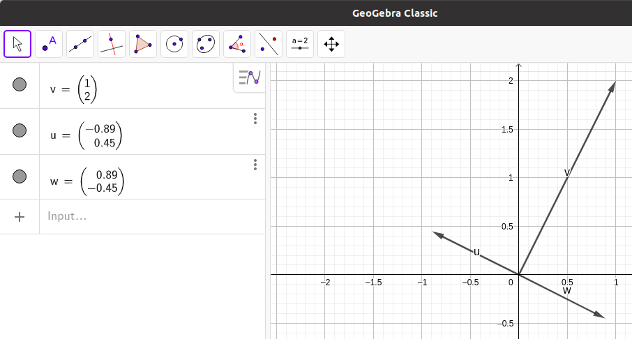

```{r setup, include=FALSE}
knitr::opts_chunk$set(echo = TRUE)
library(reticulate)
knitr::opts_chunk$set(engine.path = list(octave = "/usr/bin/octave"))
```

## Pregunta 1

Crear una función que encuentre un vector $\vec{CD}$ equivalente a $\vec{AB}$ donde $A = (1,2)$ y $B = (0,3)$ y tal que su origen esté en el punto $C = (-1,0)$

Primero se encuentran los componentes del vector $\vec{AB}$

$$\vec{AB} = (0-1,3-2) = (-1,1)$$

Como el vector $\vec{CD}$ es equivalente, y contamos con el punto $C$ pero no con el $D$, podemos expresar lo siguiente

$$\vec{CD} = (a + 1, b - 0) = (-1,1)$$

$$a + 1 = -1 \quad \implies \quad a = -2$$
$$b - 0 = 1 \quad \implies \quad b = 1$$

Las coordenadas que debe tener $D$ para que el vector $\vec{CD}$ sea equivalente a $\vec{AB}$ son $(-2,1)$


Usando Python

```{python p1}
import numpy as np

def equivalente(a, b, c):
    '''Función para encontrar las coordenadas del punto D 
    para que los vectores AB y CD sean equivalentes'''
    if len(a)==len(b) and len(a) == len(c):
        v = b - a
        return v + c
    else:
        return "Error"
        
equivalente(np.array([1,2]), np.array([0,3]), np.array([-1,0]))
```


## Pregunta 2

Encontrar el módulo y dirección del vector de componentes $(9,-10)$

El módulo es igual a la norma del vector

$\Vert (9,-10) \Vert = \sqrt{9^2 + (-10)^2} = \sqrt{181} =$ `r sqrt(181)`

```{r p2}
library(pracma)
ModDir = function(v){
  c(Norm(v), atan2(v[2], v[1]) * 180/pi)
}

ModDir(c(9,-10))
```


## Pregunta 3

Dados los vectores $u = (9,1,0)$, $v = (-3,5,1)$ y $w = (1,10,-5)$

* Comprobad que el producto escalar cumple la propiedad conmutativa

$$\langle u,v \rangle = 9\cdot -3 + 1\cdot 5 + 0\cdot 1 = -27 + 5 = -22$$
$$\langle v,u \rangle = -3\cdot 9 + 5\cdot 1 + 1\cdot 0 = -27 + 5 = -22$$
$$\langle u,v \rangle = \langle v,u \rangle$$

Usando Octave

```{octave p3_1}
u = [9, 1, 0];
v = [-3, 5, 1];

function p = prodEsc(x,y)
  if length(x) == length(y)
    p = 0;
    for i = 1: length(x)
      p = p + x(i)*y(i);
    endfor
  else
    fprintf("Error")
  endif
endfunction

prodEsc(u,v) == prodEsc(u,v)
```


* Comprobad que el producto escalar cumple la propiedad distributiva

$$\langle u,(v + w) \rangle = 9\cdot -2 + 1\cdot 15 + 0\cdot -4 = -3$$


$$\langle u,v \rangle = 9\cdot -3 + 1\cdot 5 + 0\cdot 1 = -27 + 5 = -22$$
$$\langle u,w \rangle = 9\cdot 1 + 1\cdot 10 + 0\cdot -5 = 9 + 10 = 19$$

$$\langle u,v \rangle + \langle u,w \rangle = -22 + 19 = -3$$

$$\langle u,(v + w) \rangle = \langle u,v \rangle + \langle u,w \rangle$$

Usando Octave

```{octave p3_2}
u = [9, 1, 0];
v = [-3, 5, 1];
w = [1, 10, -5];

function p = prodEsc(x,y)
  if length(x) == length(y)
    p = 0;
    for i = 1: length(x)
      p = p + x(i)*y(i);
    endfor
  else
    fprintf("Error")
  endif
endfunction

prodEsc(u, v + w) == prodEsc(u,v) + prodEsc(u,w)
```


* Comprobad que el producto escalar cumple la propiedad asociativa entre escalares y vectores

$$\lambda = 3 \qquad \langle (3u),v \rangle = 27\cdot -3 + 3\cdot 5 + 0\cdot 1 = -66$$
$$\langle u,(3v) \rangle = 9\cdot -9 + 1\cdot 15 + 0\cdot 3 = -66 \qquad 3 \langle u,v \rangle = 3\cdot -22 = -66$$
$$\langle (3u),v \rangle = \langle u,(3v) \rangle = 3 \langle u,v \rangle$$

```{octave p3_3}
u = [9, 1, 0];
v = [-3, 5, 1];
w = [1, 10, -5];
l = 3;

function p = prodEsc(x,y)
  if length(x) == length(y)
    p = 0;
    for i = 1: length(x)
      p = p + x(i)*y(i);
    endfor
  else
    fprintf("Error")
  endif
endfunction

prodEsc(3*u, v) == 3*prodEsc(u,v)
prodEsc(u,3*v) == 3*prodEsc(u,v)
```


## Pregunta 4

Dado $u = (11,20,-13)$,

* Calculad su norma

$\Vert (11,20,-13) \Vert = \sqrt{11^2 + 20^2 + (-13)^2} = \sqrt{690} =$ `r sqrt(690)`

Usando Python

```{python p4_1}
u = np.array([11, 20, -13])
np.linalg.norm(u)
```


* Comprobad que $\Vert 5u \Vert = 5 \Vert u \Vert$

$\Vert 5u \Vert = \sqrt{55^2 + 100^2 + (-65)^2} = \sqrt{17250} =$ `r sqrt(17250)`

$5\cdot \Vert u \Vert =$ `r sqrt(690) * 5`

$$5\cdot \Vert u \Vert  = \Vert 5u \Vert$$

Usando python

```{python p4_2}
np.linalg.norm(5 * u) == 5*np.linalg.norm(u)
```


* Comprobad que $\Vert (-9)u \Vert = |-9| \cdot \Vert u \Vert = 9 \Vert u \Vert$

$\Vert (-9)u \Vert = \sqrt{(-99)^2 + (-180)^2 + 117^2} = \sqrt{55890} =$ `r sqrt(55890)`

$|-9| \cdot \Vert u \Vert = 9\cdot \sqrt{690} =$ `r sqrt(690) * abs(-9)`

$|9\cdot \sqrt{690} =$ `r sqrt(690) * 9`

$\Vert (-9)u \Vert = |-9| \cdot \Vert u \Vert = 9 \Vert u \Vert$

Usando python

```{python p4_3}
import math
np.linalg.norm((-9)*u) == abs(-9) * np.linalg.norm(u)
np.linalg.norm((-9)*u) == 9 * np.linalg.norm(u)
```

* Comprobad que si se divide por su norma se obtiene otro vector que es unitario

$$\frac{1}{\Vert u \Vert} \cdot u = \left ( \frac{11}{\sqrt{690}}, \frac{20}{\sqrt{690}}, \frac{-13}{\sqrt{690}} \right )$$

$$\Vert \frac{1}{\Vert u \Vert} \cdot u \Vert = \frac{1}{\Vert u \Vert} \cdot \Vert u \Vert = 1$$

Usando python

```{python p4_4}
np.linalg.norm(1/np.linalg.norm(u) * u)
```


## Pregunta 5

Dados los puntos $A = (1,-2,0)$, $B = (10,-11,7)$ y $C = (-15,-7,3)$

* Calcula la distancia entre $A$ y $B$

$$\vec{AB} = (10 - 1, -11 + 2, 7 - 0) = (9,-9,7)$$

$\text{d}(A,B) = \Vert \vec{AB} \Vert = \sqrt{9^2 + (-9)^2 + 7^2} = \sqrt{211} =$ `r sqrt(211)`

Usando R

```{r p5_1}
A = c(1,-2,0)
B = c(10,-11,7)
C = c(-15,-7,3)

distancia = function(a,b){
  if(length(a) == length(b)){
    Norm(b-a)
  }else{
    print("Error")
  }
}

distancia(A,B)
```


* Calcula la distancia entre $A$ y $C$

$$\vec{AC} = (-15 - 1, -7 + 2, 3 - 0) = (-16,-5,3)$$

$\text{d}(A,C) = \Vert \vec{AC} \Vert = \sqrt{(-16)^2 + (-5)^2 + 3^2} = \sqrt{290} =$ `r sqrt(290)`

Usando R

```{r p5_2}
distancia(A,C)
```


* Calcula la distancia entre $B$ y $C$

$$\vec{BC} = (-15 - 10, -7 + 11, 3 - 7) = (-25,4,-4)$$

$\text{d}(B,C) = \Vert \vec{BC} \Vert = \sqrt{(-25)^2 + 4^2 + (-4)^2} = \sqrt{657} =$ `r sqrt(657)`

Usando R

```{r p5_3}
distancia(B,C)
```


## Pregunta 6

Dados los puntos $A = (1,-2,0)$, $B = (10,-11,7)$ y $C = (-15,-7,3)$

* Encuentra el ángulo que forman los vectores $AB$ y $AC$

$$\vec{AB} = (9,-9,7) \qquad \vec{AC} = (-16,-5,3)$$

$$\alpha = \arccos \left ( \frac{\langle \vec{AB}, \vec{AC} \rangle}{\Vert \vec{AB} \Vert \cdot \Vert \vec{AC} \Vert} \right ) = \arccos \left ( \frac{-78}{\sqrt{211} \cdot \sqrt{290}} \right ) = \arccos \left ( \frac{-78}{\sqrt{61190}} \right ) =$$ `r acos(-78/sqrt(61190))`

Usando R

```{r p6_1}
productoEscalar = function(x,y){
  if(length(x) == length(y)){
    sum(x*y)
  }else{
    print("Error")
  }
}

angulo = function(x,y){
  if(length(x) == length(y)){
    acos(productoEscalar(x,y)/ (Norm(x) * Norm(y))) * 180/pi
  }else{
    print("Error")
  }
}
Norm(B-A) * Norm(C-A)
angulo(B - A, C - A)
```


* Calcula el producto vectorial de los vectores $CB$ y $AC$

$$\vec{CB} = (10+15, -11+7, 7-3) = (25,-4, 4) \qquad \vec{AC} = (-16,-5,3)$$

$$\vec{CB} \wedge \vec{AC} = (-4(3) - 4(-5), \ 4(-16) - 25(3), \ 25(-5) - (-4)(-16))$$
$$\vec{CB} \wedge \vec{AC} = (-12 + 20, \ -64 - 75, \ -125 - 64) = (8, -139, -189)$$

Usando R

```{r p6_2}
prodVec = function(A,B){
  if(length(A) == length(B) && length(A) == 3){
    c(A[2]*B[3] - A[3]*B[2], A[3]*B[1] - A[1]*B[3], A[1]*B[2] - A[2]*B[1])
  }else{
    print("Error")
  }
}
prodVec(B-C,C-A)
```


## Pregunta 7

Crea una función a la que le des un vector de $\mathbb{R}^2$ y te devuelva uno de sus vectores ortogonales.
Mejora dicha función para que te devuelva todos los posibles vectores ortogonales
Mejórala más aún y que te devuelva los vectores ortogonales unitarios.

Tomando en cuenta la siguiente expresión

$$\langle u,v \rangle = u_1\cdot v_1 + u_2\cdot v_2 = 0$$

$$u_1\cdot v_1 = - u_2\cdot v_2 \quad \implies \quad \frac{u_1}{-u_2} = \frac{v_2}{v_1} \quad \implies \quad u_1 = v_2, \ -u_2 = v_1$$


* Primer versión

```{python p7_1}
def ortogonal(x):
    if(len(x) != 2):
        return "Error"
    return np.array([-x[1], x[0]])
    
ortogonal(np.array([1,2]))
ortogonal(np.array([-45,-74]))
```

* Segunda versión

Para definir esta función, es necesario indicar por lo menos un vector y el componente $y$ del otro vector. Se pedirá introducir tanto el vector, como el compoenente $y$ de inicio y el de final, donde el primero debe ser menor que el segundo. De esta manera, se regresará los vectores ortogonales al dado, dentro del rango establecido, saltando su valor en 1.

```{python p7_2}
def ortogonal2(v, y_1, y_2):
    if(len(v) != 2):
        return "Error"
    r = []
    for i in range(y_1, y_2+1):
        r.append(np.array([-v[1]*i/v[0], i]))
    return r
    
ortogonal2(np.array([1,2]), 4, 8)
```


* Tercera versión

Analizando en un plano cartesiano, un vector dibujado solo tiene dos posibles vectores ortogonales unitarios.

```{python p7_3}
def ortogonal3(x):
    if(len(x) != 2):
        return "Error"
    u = np.array([-x[1], x[0]])
    v = -u
    
    e = 1 / np.linalg.norm(u)
    f = 1 / np.linalg.norm(v)
    
    return [e*u, f*v]
    
ortogonal3(np.array([1,2]))
```


