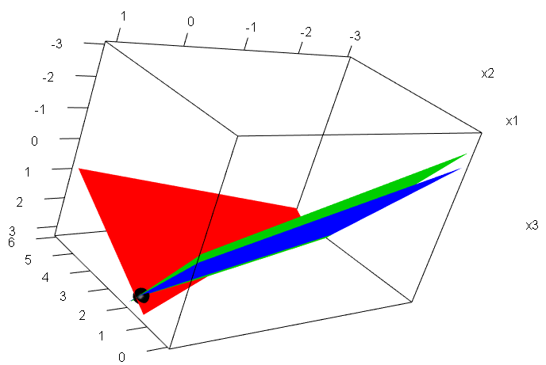
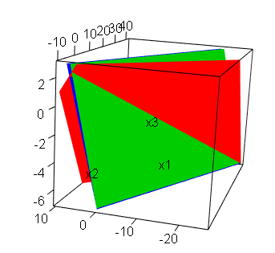

```{r setup, include=FALSE}
knitr::opts_chunk$set(echo = TRUE)
```

## Introducción
Este documento tiene como fin el mostrar las cuestiones básicas relacionadas al manejor y resolución de sistemas de ecuaciones lineales y el proceso para poder darle solución a ecuaciones matriciales. Esto con ayuda del lenguaje de programación R

Toda la información recabada está basado enteramente de la obra de Juan Gabrial Gomila Salas, CEO de Frogames, Matemático, Data Scientist & Game Designer

## Resolución de un sistema compatible determinado con la función solve

Dado el sistema de ecuaciones lineales

$$\left \{ \begin{matrix}
a_{11}x_1+a_{12}x_2+\cdots+a_{1n}x_n & = & b_1\\
a_{21}x_1+a_{22}x_2+\cdots+a_{2n}x_n & = & b_2\\
\vdots & \ & \vdots\\
a_{m1}x_1+a_{m2}x_2+\cdots+a_{mn}x_n & = & b_m\\
\end{matrix} \right .$$

Al representarlo en su forma matricial $AX=b$, podemos darle una solución con el uso de la función **solve(A,b)**, la cual funciona si, y solo si, el sistema de ecuaciones es compatible determinado.

### Ejemplo 1

Dado el siguiente sistema de ecuaciones lineales, calculemos su solución

$$\left \{ \begin{matrix}
x_1 & + & x_2 & + & 2x_3 & = & 9\\
2x_1 & + & 4x_2 & - & 3x_3 & = & 1\\
3x_1 & + & 6x_2 & - & 5x_3 & = & 0
\end{matrix} \right .$$

En este caso, tanto el número de ecuaciones, así como el número de incógnitas es 3

En su forma matricial, se expresaría en R como:

```{r}
A = rbind(c(1,1,2), c(2,4,-3),c(3,6,-5))
b = c(9,1,0)
Ab = cbind(A,b)
```

Observamos en el anterior chunk que la función **cbind()** es usada para unir dos matrices en columnas, solo si la dimensión de ambas lo permite. En le documento de **Matrices con R** se menciona la misma función, pero con un uso distinto.

Mediante el teorema de Rouché-Frobenius, y con ayuda de R, verificamos si el rango de la matriz $A$ es igual al rango de la matriz Ampliada, para saber si el sistema es compatible

```{r}
qr(A)$rank == qr(Ab)$rank
```

Ahora nos aseguramos si este es igual al número de incógnitas, el cual es 3, para saber si es un sistema compatible determinado.

```{r}
qr(A)$rank == 3
```

De esta manera, es posible aplicar la funcíón **solve()** a este caso, por lo que procedemos a realizarla

```{r}
solve(A,b)
```

La solución que nos devuelve, se puede expresar como:

$$x_1 = 1, \quad x_2 = 2, \quad x_3 = 3$$
Una forma de comprobar este resultado es sustituyendo días variables en cada una de las ecuaciones del sistema y verificar la igualdad en todas.

Otra forma de comprobar el resultado, es realizando un producto de matrices con la matriz A y el vector de resultados

```{r}
solution = c(1,2,3)
A%*%solution
```

o de la siguiente forma

```{r}
A%*%solution == b
```

Así, nos damos cuenta que el vector (1,2,3) es correcto

## Resolución de un sistema compatible determinado con la libreria matlib

Otra forma para dar solución a un sistema determinado, se da gracias a la libreria **Matlib**, la cual ofrece variedad de funciones útiles en resolver sistemas de ecuaciones lineales, sobre todos aquellos con 2 o 3 ecuaciones

### Ejemplo 2

Dada el siguiente sistema de ecuaciones lineales

$$\left \{ \begin{matrix}
2x_1 & + & 2x_2 & = & 1\\
-x_1 & + & x_2 & = & 2
\end{matrix} \right .$$

Al expresarlo en su forma matricial, obtenemos

```{r}
A = rbind(c(2,2),c(-1,1))
b = c(1,2)
Ab = cbind(A,b)
```

Una vez tenemos la forma matricial, podemos mostrar el sistema con la función **showEqn()** de la libreria **matlib**, la cual recibe como parámetros en primer lugar la matriz de coeficientes y en segundo la matriz de términos independientes

```{r}
library(matlib)
showEqn(A,b)
```

Esta misma libreria nos permite obtener el rango de de una matriz con la función **R()**

```{r}
R(A)

R(Ab)
```

Gracias a esto podemos determinar el tipo de sistema con el que se trabaja. En este caso, al ser igual los rangos de ambas matrices, del mismo modo que es igual al número de incógnitas, podemos decir que el sistema es compatible determinado.

Por otro lado, con la función **all.equal()** es posible comprobar que un sistema es compatible. Esta función compara los rangos de matrices, y determinar si son iguales

```{r}
all.equal(R(A),R(Ab))
```

Finalmente, con la función **Solve()** de matlib podemos resolver el sistema.

```{r}
Solve(A, b, fractions = TRUE)
```

Cabe resaltar que el parámetro **fractions**, que recibe un valor booleano, permite mostrar las soluciones no enteras en forma de fracción, siempre que exista

## Representación de sistemas con R

Otro punto importante de la libreria **matlib** es el de representar de manera gráfica las ecuaciones de un sistema lineal. Con las funciones **plotEqn()** para dibujar un sistema lineal de 2 incógnitas, y **plotEqn3d()** para dibujar un sistema lineal de 3 incógnitas.

Los parámtetros que reciben son: la matriz de coeficientes y la matriz de términos independientes

### Ejemplo 2

En caso de tener un sistema de dos ecuaciones con dos incógnitas

```{r}
showEqn(A, b)
```

Su representación sería

```{r}
plotEqn(A, b)
points(-3/4, 5/4, col = "blue", pch = 21)
```

La solución que anteriormente habíamos encontrado

$$\left \{ \begin{matrix}
x_1 & = & -\frac{3}{4}\\
x_2 & = & \frac{5}{4}
\end{matrix} \right .$$

es el punto donde ambas rectas intersectan

Además, con la función **points()**, se puede indicar un punto dentro del plano. En este caso, se coloco, en el punto de intersección.

### Ejemplo 3 

En caso de tener un sistema de 3 ecuaciones y 2 variables, como el siguiente caso:

$$\left \{ \begin{matrix}
4x & + & 2y & = & 3\\
x & - & 2y & = & 2\\
3x & + & 4y & = & 1
\end{matrix} \right .$$

Pasándolo a su forma matricial tenermos

```{r}
A = rbind(c(4,2), c(1,-2), c(3,4))
b = c(3,2,1)
showEqn(A,b)
```

Para su representación gráfica, se vuelve a usar la función **plotEqn** 

```{r}
plotEqn(A, b)
```

Debido a que existe un punto de intersección para todas las rectas, significa que el sistema es compatible determinado

### Ejemplo 1

Si en lugar de tener un sistema de 2 incógnitas, como los anteriores, tenemos un sistema de 3 ecuaciones como es el casi dek ejemplo 1

```{r}
A = rbind(c(1,1,2),c(2,4,-3),c(3,6,-5))
b = c(9,1,0)
showEqn(A,b)
```

Como se menciono antes, este sistema al ser de 3 incognitas, para su representación gráfica haremos uso de la función **plotEqn3d()**, 

```{r}
library(matlib)
plotEqn3d(A, b, xlim = c(-3,3), ylim = c(0,6))
```



El resultado de la línea de código anterior es interactivo, no una imagen

Como se ve en la gráfica, un punto negro sobresale, el cual indica el punto donde se intersectan las 3 ecuaciones representadas mediante planos. A su vez, este punto indica la solución dada al inicio, es decir, el punto de intersección es aquel ocn las coordenadas $P = (1,2,3)$


## Método de Gauss

Tal es la potencia de la librería **matlib**, que podemos hacer una implementación del método de Gauss, con el fin de dar una resolución a sistemas de ecuaciones lineales.

Esto se realiza con la función **echelon()**, la cual calcula la escalonada reducida de cualquier matriz

La relevancia de esta función, recae en que al ser la escalonada reducida lo que calcula, nos permite deducir el resultado.

### Ejemplo 1

Recuperamos el sistema de 3 ecuaciones con 3 incógnitas

$$\left \{ \begin{matrix}
x_1 & + & x_2 & + & 2x_3 & = & 9\\
2x_1 & + & 4x_2 & - & 3x_3 & = & 1\\
3x_1 & + & 6x_2 & - & 5x_3 & = & 0
\end{matrix} \right .$$

```{r}
A = rbind(c(1,1,2), c(2,4,-3), c(3,6,-5))
B = c(9,1,0)
AB = cbind(A,b)
```

Ahora, podremos usar la función **echelon()** pasándole como parámetro la matriz ampliada

```{r}
echelon(AB)
```

De la matriz escalonada reducida, deducimos los resultados para cada incógnita

$$x_1 = 1, \quad x_2 = 2, \quad x_3 = 3$$

Esto se debe a que cada columna representa una incógnita, mientras que la última representa los términos independientes.

Por otra parte, cabe recalcar que la función anteriormente usada tiene un parámetro **verbose**, que igualado a **TRUE** muestra las operaciones elementales llevado a cabo para conseguir la matriz escalonada reducida. 

A su vez, el parámetro **fractions** está presente igualmente en esta función.

```{r}
echelon(AB, verbose = TRUE, fractions = TRUE)
```

## Resolución de un sistema compatible indeterminado

Este tipo de sistemas no son posibles de resolver con la función **solve()**, pues solo resuelve sistemas compatibles determinados

Sin embargo, **matlib**, nos ofrece la posibilidad de resolver este tipo de casos, 

### Ejemplo 4

Dado el siguietne sistema de ecuaciones lineales:

$$\left \{ \begin{matrix}
x & + & y & - & z & = & 2\\
x & - & y & + & z & = & 1\\
3x & + & y & - & z & = & 5
\end{matrix} \right.$$

Se trata de un sistema de 3 ecuaciones y 3 incógnitas. Ahora lo pasaremos a su forma matricial

```{r}
A = matrix(c(1,1,-1,1,-1,1,3,1,-1), byrow = TRUE, nrow = 3, ncol = 3)
b = c(2,1,5)
AB = cbind(A,b)
```

Como lo hemos hecho antes, pasaremos a verificar si el sistema es compatible indeterminado. Comprobamos los rangos de la matriz $A$ y $AB$

```{r}
c(R(A), R(AB))
all.equal(R(A),R(AB))
```

Observamos, que el rango es el mismo entre las matrices, pero menor al número de incógnitas del sistema. Por el Teorema de Rouché-Frobenius se clasifica este sistema como compatible indeterminado.

Otra forma de comprobar que, en efecto es un sistema indeterminado, podemos hacer uso de la función **echelon()**

```{r}
echelon(AB)
```

El resultado que nos ofrece es interesante, nos indica que la columna de la incógnita $z$ no tiene pivote y, por lo tanto, es un término independiente el cual puede tomar cualquier valor en $\mathbb{R}$

Gracias a la representación anterior, es posible deducir el resultado. no obstante lo podemos tener más claro si hacemos uso de la función **Solve()**

```{r}
Solve(A, b, fractions = TRUE)
```

De esta manera, vemos que $x_1 = \frac{3}{2}$, $x_3$ es libre y $x_2$ depende del valor que tome $x_3$

Es decir, nuestra solución es de la forma

$$x_1 = \frac{3}{2}, \quad x_2 = \frac{1}{2} + x_3, \quad x_3 \in \mathbb{R}$$

Otra forma de visualizar el resultado del sistema es mediante una representación gráfica del mismo

En este caso, por tener 3 incógnitas, se usará la función **plotEqn3d()**

```{r}
plotEqn3d(A, b, xlim = c(-10,10), ylim = c(-10,10), zlim = c(-10,10))
```



Gráficamente, podemos concluir que el conjunto de soluciones es infinito pues se trata de una recta, la intersección de los 3 planos

De hecho, podemos representar nuestro conjunto de soluciones por

$$\left \{ x \in \mathbb{R}^3 \quad : \quad x_1 = \frac{3}{2}, \quad x_2 = \frac{1}{2}+x_3, \quad x_3 \in \mathbb{R} \right \}$$

Esto se suele también escribir en formato vectorial, donde el punto $(x_1,x_2,x_3)$ quiere decir que se trata del vector de resultados

$$(x_1,x_2,x_3) = \bigg(\frac{3}{2}, \frac{1}{2},0 \bigg) + \lambda(0,1,1)$$

## Sistemas incompatibles

Gracias a las funciones usadas con anterioridad, es fácil determinar si el sistema es incompatible

### Ejemplo 5

Supongamos que contamos con el siguiente sistema de ecuaciones lineal, en el cual tenemos 3 ecuaciones y 2 incógnitas:

$$\left \{ \begin{matrix}
x & + & y & = & 2\\
x & - & y & = & 1\\
2x & + & y & = & 3
\end{matrix} \right .$$

```{r}
A = cbind(c(1,1,2),c(1,-1,1))
b = c(2,1,3)
AB = cbind(A,b)
```

Al comparar los rangos de la matriz de coeficientes y de la matriz ampliada, observamos que:

```{r}
c(R(A),R(AB))
all.equal(R(A),R(AB))
```

Dicha observación, en base al Teoream de Rouché-Frobenius, concluye que el sistema es incompatible.

Tanto con la función **echelon()**, como la función **Solve()** nos ayudan a ver que es así.

```{r}
echelon(AB)
Solve(A,b, fractions = TRUE)
```

En ambos casos nos muestra las siguientes igualdades

$$0 = 1 \quad \text{y} \quad 0 = \frac{1}{3}$$

Estas, por obviedad, son falsas. De esta manera concluimos que el sistema es incompatible

Otra forma de verificar dicho resultado es de manera gráfica:

```{r}
plotEqn(A,b,xlim = c(0,2), ylim = c(0,1.5))
```

En dicha gráfica, observamos puntos donde 2 rectas intersectan, por lo que podemos definir a dichos puntos, soluciones para cada par de ecuaciones. Sin embargo, el sistema cuenta con 3 ecuaciones, y no existe punto en común para dichas ecuaciones. En otras palabras, podemos concluir lo mismo, el sistema es incompatible.


## Ecuaciones matriciales

Para este tema, tenemos que recordar que dada una ecuación matricial, si la tenemos de la forma $AX = B$, donde $A,B$ son matrices, entonces se puede resolver con la función **solve(A,B)**

### Ejemplo 6 

Sea la ecuación matricial

$$AX + 3B = (C+D)X + 3D + 10I_2$$ 

donde

$$A = \begin{pmatrix}
0 & 4\\
2 & 1
\end{pmatrix}, \quad B = \begin{pmatrix}
1 & -1\\
2 & 3
\end{pmatrix}, \quad C = \begin{pmatrix}
1 & 2\\
3 & -2
\end{pmatrix}, \quad D = \begin{pmatrix}
-2 & 1\\
-1 & 1
\end{pmatrix}, \quad I_2 = \begin{pmatrix}
1 & 0\\
0 & 1
\end{pmatrix}$$

Pasando los términos multiplicados por $X$ a la izquierda y los que no a la derecha, obtenemos

$$AX - (C + D)X = 3D - 3B + 10I_2$$

Sacando factor común $X$ por la derecha de la igualdad, además de sacar factor común $3$ a la izquierda

$$(A - (C + D))X = 3(D - B) + 10I_2$$

Debemos de ser conscientes que tanto $(A - (C + D))$ como $3(D - B) + 10I_2$ son matrices por si mismas

Ahora procederemos a hacer uso de R para darle una oslución

```{r}
A = rbind(c(0,4),c(2,1))
B = rbind(c(1,-1),c(2,3))
C = rbind(c(1,2),c(3,-2))
D = rbind(c(-2,1),c(-1,1))
I = diag(1,nrow = 2, ncol = 2)

M = A - (C + D)
N = 3*(D - B) + 10*I
```

Calculadas $M$ y $N$, la ecuación que resulta es $MX = N$, que como se menciona al comienzo del tema, se puede resolver con la ya mencionada función.

```{r}
X = solve(M,N)
X
```

Ahora pasamos a comprobar dicho resultado

```{r}
A%*%X + 3*B == (C + D)%*%X + 3*D + 10*I
```

