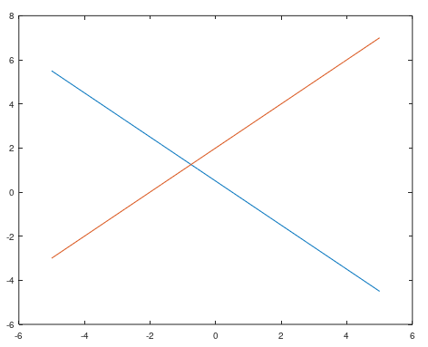
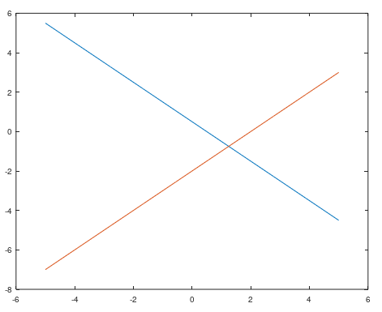
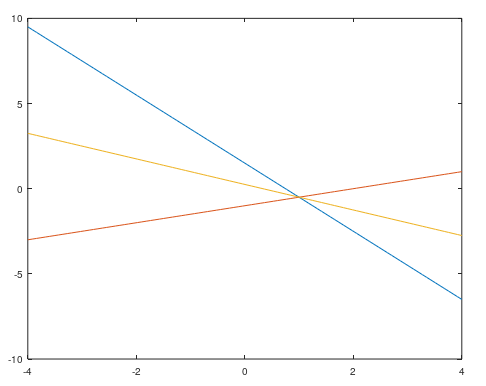
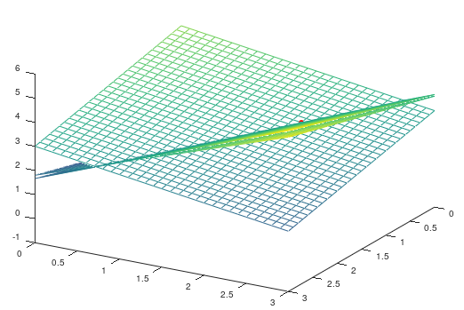
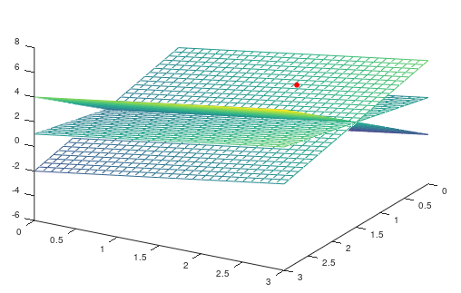
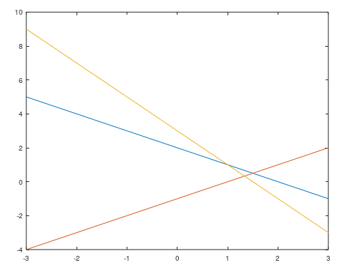

```{r setup, include=FALSE}
knitr::opts_chunk$set(echo = TRUE)
knitr::opts_chunk$set(engine.path = list(octave = "/usr/bin/octave"))
```

## Introducción
Este documento tiene como fin el mostrar las cuestiones básicas relacionadas al manejor y resolución de sistemas de ecuaciones lineales y el proceso para poder darle solución a ecuaciones matriciales. Esto con ayuda del lenguaje de programación R

Toda la información recabada está basado enteramente de la obra de Juan Gabrial Gomila Salas, CEO de Frogames, Matemático, Data Scientist & Game Designer

## Sistema compatible determinado

Dada el sistema de ecuaciones lineales:

$$\left \{ \begin{matrix}
a_{11}x_1+a_{12}x_2+\cdots+a_{1n}x_n & = & b_1\\
a_{21}x_1+a_{22}x_2+\cdots+a_{2n}x_n & = & b_1\\
\vdots & \ & \vdots\\
a_{m1}x_1+a_{m2}x_2+\cdots+a_{mn}x_n & = & b_m
\end{matrix} \right .$$

Al pasarlo a su forma matricial, $AX = b$, podremos resolverlo de forma sencilla con la función **linsolve(A,b)** siempre que se trata de un sistema compatible determinado

### Ejemplo 1

Dado el sistema de ecuaciones lineales, calculemos su solución:

$$\left \{ \begin{matrix}
x_1 & + & x_2 & + & 2x_3 & = & 9\\
2x_1 & + & 4x_2 & - & 3x_3 & = & 1\\
3x_1 & + & 6x_2 & - & 5x_3 & = & 0
\end{matrix} \right .$$

Se trata de un sistema de ecuaciones de 3 ecuaciones y 3 incógnitas

```{octave}
A = [1 1 2; 2 4 -3; 3 6 -5];
b = [9; 1; 0];
AB = [A b];
```

Comprobamos primero que el sistema es compatible, con el Teorema de Rouché-Frobenius, esto comparando el rango de la matriz $A$ y de la matriz ampliada

```{octave}
A = [1 1 2; 2 4 -3; 3 6 -5];b = [9; 1; 0];AB = [A b];
a = rank(A) == rank(AB);
a
```

Ahora tenemos que comprobar que el sistema es compatible determinado, por lo que el rango debe ser igual al número de incógnitas.

```{octave}
A = [1 1 2; 2 4 -3; 3 6 -5];
a = rank(A) == 3;
a
```

Finalmente pasamos a resolverlo

```{octave}
A = [1 1 2; 2 4 -3; 3 6 -5];b = [9; 1; 0];
x = linsolve(A,b);
x
```

Para comprobar que este es el resultado

```{octave}
A = [1 1 2; 2 4 -3; 3 6 -5];b = [9; 1; 0];
x = [1; 2; 3];
a = A*x == b;
a
```


## Representación de sistemas

El observar a detalle una representación visual de nuestro sistema, nos puede ofrecer mucha información con un solo vistazo

### Ejemplo 2

Dado el sistema de 2 ecuaciones y 2 incógnitas:

$$\left \{ \begin{matrix}
2x & + & 2y & = & 1\\
-x & + & y & = & 2
\end{matrix} \right .$$

Necesitamos representar cada ecuación de forma explícita, es decir, de manera que aislemos una variable

$$\left \{ \begin{matrix}
y & = & \frac{1-2x}{2}\\
y & = & 2+x
\end{matrix} \right .$$

Representamos gráficamente el sistema del siguiente modo:

```{octave}
x = linspace(-5,5,10);
y1 = (1-2*x)/2;
y2 = 2+x;
plot(x,y1,x,y2);
```

y con esto, al ejecutarlo en **GNU Octave**, obtenemos



Para realizar este proceso no es necesario tomar una variable en especial. Probaremos que se puede lograr al despejar $x$. En primer lugar el sistema sería:

$$\left \{ \begin{matrix}
x & = & \frac{1-2y}{2}\\
x & = & y-2
\end{matrix} \right .$$

Ahora declaramos las siguientes varaibles y graficarlo

```{octave}
y = linspace(-5,5,10);
x1 = (1-2*y)/2;
x2 = y - 2;
plot(y,x1,y,x2);
```

La gráfica sería



El punto de intersección entre 2 rectas es la solución para el sistema

```{octave}
A = [2 2; -1 1]; b = [1; 2];
linsolve(A,b)
```


### Ejercicio 6

Probar que se trata de un sistema compatible determinado mediante el Teorema Rouché-Frobenius

```{octave}
A = [2 2; -1 1]; b = [1; 2]; AB = [A b];
a = rank(A) == rank(AB);
a
```

Por este motivo, el sistema del ejemplo 2 es compatible

```{octave}
A = [2 2; -1 1];
a = rank(A) == 2;
a
```

Por ello, el sistema es compatible determinado


### Ejemplo 3

Dado, el sistema de 3 ecuaciones lineales con 2 incógnitas

$$\left \{ \begin{matrix}
4x_1 & + & 2x_2 & = & 3\\
x_1 & - & 2x_2 & = & 2\\
3x_1 & + & 4x_2 & = & 1
\end{matrix} \right .$$

Reescribiéndolo del siguiente modo:

$$\left \{ \begin{matrix}
x_2 & = & \frac{3-4x_1}{2}\\
x_2 & = & \frac{x_1-2}{2}\\
x_2 & = & \frac{1-3x_1}{4}
\end{matrix} \right .$$

Su representación gráfica viene dada por

```{octave}
x1 = linspace(-4,4,100);
x2a = (3-4*x1)/2;
x2b = (x1-2)/2;
x2c = (1-3*x1)/4;
plot(x1,x2a,x1,x2b,x1,x2c)
```

Ejecutando este código en **GNU Octave** obtenemos el siguiente gráfico:




### Ejemplo 1

Si nos diesen por ejemplo un sistema de 3 ecuaciones y lo quisiésemos representar, una de las formas de hacerlo es con la función **plot3** del sisguiente modo:

Recuperamos el sistema del Ejemplo 1:

$$\left \{ \begin{matrix}
x & + & y & + & 2z & = & 9\\
2x & + & 4y & - & 3z & = & 1\\
3x & + & 6y & - & 5z & = & 0
\end{matrix} \right .$$

Ahora, aislamos la variable $z$ de todas las ecuaciones

$$\left \{ \begin{matrix}
z & = & \frac{9-x-y}{2}\\
z & = & \frac{2x+4y-1}{3}\\
z & = & \frac{3x+6y}{5}
\end{matrix} \right .$$

Introduciendo el siguiente código en **GNU Octave** obtenemos el plot que se muestra en la siguiente diapositiva

```{octave}
%hold on - indica cuando empezamos a dibujar algún elemento
%hold off - indica el fin del dibujo de ciertos elementos
% plano
[x,y] = meshgrid(0:0.1:3);
z = (9-x-y)/2;
hold on
mesh(x,y,z)
z = (2*x+4*y-1)/3;
mesh(x,y,z)
z = (3*x+6*y)/5;
mesh(x,y,z)


%Punto de interseccción
%markersize - indica el tamaño del punto de intersección
%markerfacecolor - indica el color del relleno del punto de intersección
plot3(1,2,3, 'ro', 'markersize',5,'markerfacecolor','r');
hold off
view(120,30)
```

La represetnación dada sería.




## Método de Gauss

Existe una función muy útil en Octave, la cual nos permite calcular la matriz escalonada reducida de la matriz introducida en ésta como parámetro.

Esta función **rref()** y funciona del siguiente modo:

### Ejemplo 1

Recuperando el sistema del ejemplo 1

$$\left \{ \begin{matrix}
x & + & y & + & 2z & = & 9\\
2x & + & 4y & - & 3z & = & 1\\
3x & + & 6y & - & 5z & = & 0
\end{matrix} \right .$$

la forma matricial del sistema viene dada por

```{octave}
A = [1 1 2; 2 4 -3; 3 6 -5]
b = [9; 1; 0]
AB = [A b];

%La función rref aplicada a la matriz ampliada nos devuelve
rref(AB)
```

El resultado lo podemos representar como el siguiente sistema de ecuaciones lineales

$$\left \{ \begin{matrix}
x & = & 1\\
y & = & 2\\
z & = & 3
\end{matrix} \right .$$

Ahora probaremos que el resultado es válido

```{octave}
A = [1 1 2; 2 4 -3; 3 6 -5]; b = [9; 1; 0]
x = [1; 2; 3]

A*x == b
```


## Sistemas compatibles indeterminados

El proceso para manejar un sistema de ecuaciones lineales de éstas características

### Ejemplo 4

Dado el siguiente sistema de ecuaciones lineales:

$$\left \{ \begin{matrix}
x & + & y & - & z & = & 2\\
x & - & y & + & z & = & 1\\
3x & + & y & - & z & = & 5
\end{matrix} \right .$$

Se trata de un sistema de 3 ecuaciones y 3 incógnitas

Comprobaremos que, en efecto es un sistema indeterminado, mediante el teorema de Rouché-Frobenius

```{octave}
A = [1 1 -1; 1 -1 1; 3 1 -1];
b = [2; 1; 5];
AB = [A b];
a = rank(A) == rank(AB);
a
```

Comprobar que el rango es igual que el número de incógnitas

```{octave}
A = [1 1 -1; 1 -1 1; 3 1 -1];
rango = rank(A)
a = rank(A) == 3;
a
```

Con esto concluimos que realmente el sistema es compatible indeterminado

Otra forma de verlo es mediante la función **rref()**:

```{octave}
A = [1 1 -1; 1 -1 1; 3 1 -1];b = [2; 1; 5];AB = [A b];
rref(AB)
```

El anterior resultado nos indica que tenemos lo siguiente:

$$x = \frac{3}{2}$$
$$y-z = \frac{1}{2}$$
$$z \in \mathbb{R}$$


Con lo cual, tenemos un conjunto infinito de soluciones

$$\left \{ (x,y,z) \in \mathbb{R}^3 \quad : \quad x = \frac{3}{2}, \quad y = \frac{1}{2}+z, \quad z \in \mathbb{R} \right \}$$

Otra opción para reconocer este tipo de sistemas, es representar gráficamente el sistema e intentar intuir de qué tipo se trata.

Para ello, recordemos que necesitamos el sistema en la forma siguiente:

$$\left \{ \begin{matrix}
z & = & x & + & y & - & 2\\
z & = & 1 & - & x & + & y\\
z & = & 3x & + & y & - & 5
\end{matrix} \right .$$

Para gráficar este sistema, haremos el siguiente procedimiento como en casos anteriores

```{octave}
% meshgrid - Crear coordenadas en donde el primer número indica el inicio, el segundo
% número indica el intervalo qeu se debe tomar entre cada valor, y el tercero el fin
[x, y] = meshgrid(0:0.1:3);
z = x + y - 2;
hold on
mesh(x,y,z)
z = 1 - x + y;
mesh(x,y,z)
z = 3*x + y -5;

plot3(1,2,3, 'ro', 'markersize', 5, 'markerfacecolor', 'r');
hold off
view(120,30)
```

El resultado es:



La recto donde se cortan los planos, es la solución de este caso.


## Sistemas incompatibles

Se mostrará lo que sucede al manejar un sistema de ecuaciones lineales incompatible con los métodos mostrados hasta ahora.

### Ejemplo 5

Dado el sistema

$$\left \{ \begin{matrix}
x_1 & + & x_2 & = & 2\\
x_1 & - & x_2 & = & 1\\
2x_1 & + & x_2 & = & 3
\end{matrix} \right .$$

Primero comprobaremos mediante el Teorema de Rouché-Frobenius, si el sistema es compatible o no

```{octave}
A = [1 1; 1 -1; 2 1]; b = [2; 1; 3]; AB = [1 1 2; 1 -1 1; 2 1 3];
rank(A)
rank(AB)
rank(A) == rank(AB)
```

Con los resultados obtenimos, verificamos que este sistema es incompatible. Ahora pasaremos a experimentar lo que sucede al tratar de resolverlo.

Haremos uso primeramente de la función **rref()**, la cual con el método de Gauss nos provee la matriz escalonada reducida.

```{octave}
A = [1 1; 1 -1; 2 1]; b = [2; 1; 3]; AB =[A b];
rref(AB)
```

El resultado se puede expresar de la siguiente manera:

$$x_1 = 0, \quad x_2 = 0, \quad \text{y} \quad 0 = 1$$
Como se acaba visualizando, 0 no es igual a 1 por obvios motivos, esto nos hace concluir que el sistem es incompatible.

Ahora, verificaremos de forma visual lo anteriormente mencionado, representando cada ecuación que forma parte de nuestro sistema en un plano.

Pero antes, deberemos aislar alguna de las 2 variables del sistema, en este caso se utilizará la segunda

$$\left \{ \begin{matrix}
x_2 & = & 2 & - & x_1\\
x_2 & = & x_1 & - & 1\\
x_2 & = & 3 & - & 2x_1
\end{matrix} \right .$$

Ahora podemos proceder a dibujar la gráfica en Octave.

```{octave}
x1 = linspace(-5,5,100);
x2a = 2 - x1;
x2b = x1 - 1;
x2c = 3 - 2*x1;
plot(x1,x2a,x1,x2b,x1,x2c);
```



Como apreciamos, no existe un punto en donde las 3 rectas se intersecten, por lo tanto no hay una solución para el sistema de nuestro caso. Solo se observan puntos de solución para cada par de rectas.

Como un pequeño ejercicio, representaremos las soluciones para los 3 puntos de intersección

```{octave}
A = [1 1; 1 -1]; b = [2; 1];
par12 = linsolve(A, b)

A = [1 1; 2 1]; b = [2; 3];
par13 = linsolve(A, b)

A = [1 -1; 2 1]; b = [1; 3];
par13 = linsolve(A, b)
```


## Ecuaciones matriciales

Dada una ecuación matricial, si la tenemos de la siguiente forma $AX = B$, donde $A,B$ son matrices, entonces la podemos resolver en la mayoría de los casos haciendo uso de la función linsolve(A,B)

### Ejemplo 6 

Sea la ecuación matricial

$$AX + 3B = (C + D)X + 3D + 10I_2$$

donde

$$A = \begin{pmatrix}
0 & 4\\
2 & 1
\end{pmatrix}, \quad B = \begin{pmatrix}
1 & -1\\
2 & 3
\end{pmatrix}, \quad C = \begin{pmatrix}
1 & 2\\
3 & -2
\end{pmatrix}, \quad D = \begin{pmatrix}
-2 & 1\\
-1 & 1
\end{pmatrix}, \quad I_2 = \begin{pmatrix}
1 & 0\\
0 & 1
\end{pmatrix}$$

Pasándo los términos multiplicados con $X$ a la izquierda y los que no a la derecha, obtenemos

$$AX - (C + D)X = 3D - 3B + 10I_2$$

Sacando factor común $X$ por la derecha en el primer término, y factor común $3$ en el segundo término, tenemos

$$(A - (C + D))X = 3(D - B) + 10I_2$$

Ahora definimos las matrices y obtenemos el valor de $X$ con la función **linspace()**

```{octave}
A = [0 4; 2 1]; B = [1 -1; 2 3]; C = [1 2; 3 -2]; 
D = [-2 1; -1 1]; I = [1 0; 0 1];
M = A - (C + D); N = 3*(D - B) + 10*I;

X = linsolve(M, N)
```

Comprobaremos que en realidad este resultado es correcto

```{octave}
A = [0 4; 2 1]; B = [1 -1; 2 3]; C = [1 2; 3 -2]; D = [-2 1; -1 1]; I = [1 0; 0 1];
M = A - (C + D); N = 3*(D - B) + 10*I;
X = linsolve(M, N);

M*X == N

% O también 

A*X + 3*B == (C + D)*X + 3*D + 10*I
```

Con ambas comparaciones, confirmamos que el resultado obtenido sobre la matriz $X$, es correcto

